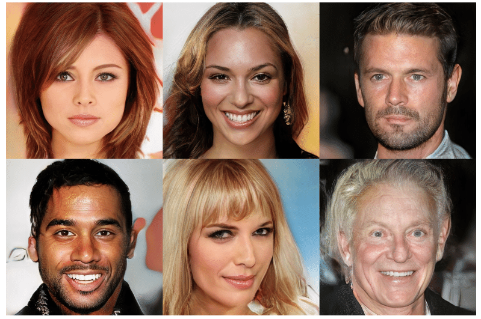

<hero-icon heroIcon='chap1'/>

In this section, we lay out some principles for AI ethics that will be followed in the rest of the course.  

 

<styled-text>

Traditionally, technology development has typically revolved around the functionality, usability, efficiency and reliability of technologies. However, AI  technology needs a broader discussion on its societal acceptability. It impacts on moral (and political) considerations. It shapes individuals, societies and their environments in a way that has ethical implications.

The interpretation of ethically relevant concepts can change with technologies (consider what “privacy” meant before social media). Furthermore, when new technologies are introduced, users often apply them for purposes other than those originally intended. This reforms the ethical landscape, and forces us to reflect and analyze the ethical basis of technology over and over again.

## Ethical frameworks

Ethical frameworks are attempts to build consensus around values and norms that can be adopted by a community – whether that’s a group of individuals, citizens, governments, businesses within the data sector or other stakeholders.

Various organisations have participated in developing an ethical framework for AI. Naturally, their views differ in some respects, but there’s also been an emerging consensus to them. According to a recent study (Jobin et al 2019), AI ethics has quite rapidly converged on a set of five principles:

* non-maleficence
* responsibility or accountability
* transparency and explainability
* justice and fairness
* respect for various human rights, such as privacy and security

The five principles of AI ethics answer different questions and focus on different values:

1. Should we use AI for good and not for causing  harm? (the principle of beneficence/ non-maleficence)
2. Who should be blamed when AI causes harm? (the principle of accountability)
3. Should we understand what, and why AI does whatever it does? (the principle of transparency)
4. Should AI be fair or non-discriminative? (the principle of fairness)
5. Should AI respect and promote human rights? (the principle of respecting basic human rights)

</styled-text>

 </img>

<styled-text>

The rest of this course will focus on these principles of AI ethics. We will analyze what these concepts imply and how they can be interpreted, in the fashion of traditional philosophy: concept analysis. We will also look at how these concepts are being applied in practice, discuss their problems and mention some open questions regarding these principles.

In the last section of the course, we will look at the project of AI ethics as a whole. We will be asking the “cui bono” question: who is AI ethics for, and who or what is left out?
Lastly, we want to note that when speaking of AI and “the social”, AI ethics is the first to come up. There are other theoretical frames for looking at ethical codes for algorithmic, data-driven systems. For example, questions of the social implications of AI come up in fields like algorithmic cultures, gender studies and media studies, amongst numerous others. Correspondingly, the cognitive and psychological aspects of human-machine interaction shapes the question of appropriate ethical framework for AI. Simply, there is a lot more to AI ethics than just data or algorithm ethics.

</styled-text>

<quiz id="85149553-407a-4733-a4a0-18d54a4715cd"></quiz>

<quiz id="0e72de1d-165b-4d3e-9e62-1008a83f2e8f"></quiz>

<quiz id="33ef4765-0577-4eed-b8e6-81a96c9a9804"></quiz>

<quiz id="c956ae17-d49d-4148-8414-029a14f3ff4c">

Imagine that one day you end up in a heated conversation on Twitter. It starts with a university professor’s (@TuringLives) tweet on photo recreation models. He tells about a model which depixelated an input image of Finnish Prime Minister Sanna Marin into a photo of a middle-aged white male:

 

Note: Artistic impression.  

Sanna Marin: Edited from original CC BY 4.0 Laura Kotila / Finnish Prime Minister’s Office  

Result image: CC BY-NC 4.0 NVIDIA Corporation  

 

What are photo (re)creation algorithms?

 

Many of the most famous examples of photo (re)creation are produced by a Generative Adversarial Network (GAN). A GAN is a type of neural network architecture for generative modeling.

 

With GANs, two networks compete against each other. One of the networks is trained to generate, for example, images like the ones in the training data (cats, human faces or other things). The other network’s task (called an adversarial network) is to separate images generated by the first network from real images in the training data.

 

The system trains the two models side by side. In the first phase of the training, the adversarial model’s task is to tell apart the real images from the training data and the clumsy attempts by the generative model. However, as the generative network slowly gets better and better, the adversarial model has to improve as well. The cycle continues until eventually the generated images are almost indistinguishable from real ones. (For more information on GANs, see the Elements of AI online course)

 

GANs do not only try to reproduce the items in the training data. Rather, the system is trained so that it has to be able to generate new, real-looking items, such as images. However, GANs – like many other contemporary algorithms – produce results that reflect the statistical patterns of the input data.

 

These images were developed in a research project by Tero Karras, Samuli Laine, Timo Aila and Jaakko Lehtinen at NVIDIA Research Helsinki ([see this paper for more information](https://research.aalto.fi/en/publications/progressive-growing-of-gans-for-improved-quality-stability-and-va)).

 

GANs can be used for many purposes, such as image-to-image translation tasks translating photos of night to day, or in generating photorealistic photos of, for example, items, objects, scenes or people.

 

To see how GANs work, please go to: http://gandissect.res.ibm.com/ganpaint.html
Explore the tool.

Next, you’ll enter into the Twitter discussion. Your task is to answer these tweets by formulating your own view on this matter.

 

How would you reply? Develop a Twitter name for yourself, and write your reply down below.

</quiz>

<quiz id="b2b4b434-f4fa-4364-8b0b-b79daac3f09c"> </quiz>
