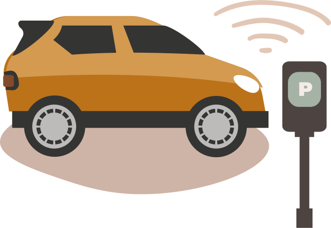

<hero-icon heroIcon='chap3'/>

In this section, we’ll use an example to explore some considerations for algorithms and accountability.

 

<text-box name="" icon="techIcon">

**In the city of Amsterdam,  parking control is partially automated and in use across 150,000 street parking spaces in the city. The service follows a three step process:**

1) Scan cars equipped with cameras drive through the city and use object recognition software to scan and identify the license plates of surrounding cars.

2) After identification, the license plate number is checked against the National Parking Register to validate if the car has permission to park at a given location. Whenever no payment has been made for current parking, the case is sent to a human inspector for further processing.

3) A parking inspector uses the scanned images to remotely assess whether there is a special situation such as loading or unloading, or stationary cars in front of a traffic light. The parking inspector may also verify the situation on-site by scooter. Whenever there is no valid reason for non-paid parking, a parking ticket is issued.

 

 

  </img>

</text-box>

<styled-text>

Parking control services provide an example of how algorithms are increasingly used for automating public services.  As algorithms are exact, fast and precise, they often promote better service efficiency, reliability and consistency.  Paradoxically, algorithms can also make systematic errors, be biased and cause serious harms. For example, scanning systems may malfunction, or suffer from bugs. They may make mistakes and suggest the tickets be issued on invalid grounds. In these cases, who should take the responsibility – and on what grounds?

Although we say things like "yes, it was the algorithm’s fault and it is responsible for the wrong decision", we do not literally mean that contemporary algorithms would be morally guilty. Instead, the algorithms are causal factors that underlie the decisions. Mere causes, however, differ from morally responsible actions.

Even though algorithms themselves cannot be held accountable as they are not moral or legal agents, the organizations designing and deploying algorithms can be taken to be morally responsible through governance structures. Thus, in the case of the city of Amsterdam, it is the human inspector that makes the final decision – and also takes responsibility. However, one day the human inspector may be replaced by algorithms, too. Who, then, will take responsibility?

</styled-text>

<text-box icon="techIcon" name="Automated vs. autonomous decision making">

**Automated systems** typically run within a well-defined set of parameters and are very restricted in what tasks they can perform. The decisions made or actions taken by an automated system are based on predefined heuristics or rules.

**An autonomous system** learns and adapts to dynamic environments, and evolves as the environment around it changes. The data  it learns and adapts to may be outside what was considered when the system was deployed.

Automation or autonomisation is about degree, and hence, they are continuums rather than simple yes/no situations. For example, a system can be said to be autonomous with respect to human control to a certain degree.

 
 
 

</text-box>
