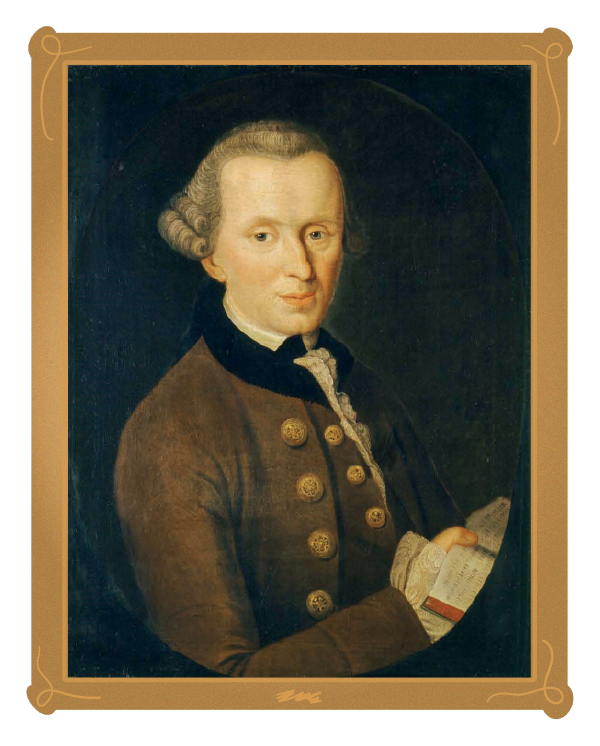

<hero-icon heroIcon='chap3'/>

<styled-text>

In ethics, accountability is closely related to the concept of “moral agency”. A moral agent is “an agent who is capable of acting with reference to right and wrong." Importantly, only moral agents are morally responsible for their actions.

**Actions and omissions**

Philosophically, a moral agent is primarily responsible for their own actions (“acts”). Sometimes agents are also responsible for not-doings, “omissions”. So, if I kill someone, I am responsible for that act. If I just let someone die, I am responsible for not-helping (omission), even if I did not actively kill someone.
Omissions and actions are not morally equal. It is morally less bad to omit a thing than to perform an act: It is worse to actively kill someone than to let them die. But this doesn’t make omissions morally right. However, we cannot be responsible for all of the things we do not do. Instead, we are responsible for only those things which we’ve deliberately and knowingly chosen to do or omit.

**Autonomy**

Philosophically, moral responsibility requires 1) moral autonomy and 2) the ability to evaluate the consequences of actions. “Moral autonomy” means the agent’s capacity to impose the moral code on oneself in a self-governed way.  Further, autonomy requires:

* The capacity to rule oneself without manipulation by others and the ability to act, without external or internal constraints
* The authenticity of the desires (values, emotions, etc) that move someone to act
* Sufficient cognitive skills – meaning an agent must be able to evaluate, to predict and to compare consequences of their actions and, also, to estimate motives that drive action by using ethically meaningful criteria

</styled-text>

<text-box icon="philIcon" name="Moral responsibility">

Immanuel Kant is one of the most famous European moral philosophers. For Immanuel Kant, practical reason — our ability to use reasons to choose our own actions — presupposes that we  are free. Actions are based on our own will to utilize a moral law to guide our decisions. For Kant, and Kantians, the claim is that this capacity (to impose the moral law upon ourselves) is the ultimate source of all moral value.

So, according to Kant, we owe ourselves moral respect in virtue of our autonomy. But we owe similar respect to all other persons in virtue of their capacity. Hence (via the second formulation of Kant’s famous Categorical Imperative), we are obliged to act out of fundamental respect for other persons in virtue of their autonomy. In this way, autonomy serves as both a model of practical reason in the determination of moral obligation and as the feature of other persons who deserve moral respect from us. (For further discussion, see [Immanual Kant and moral philosophy](https://en.wikipedia.org/wiki/Categorical_imperative).)

 </img>

</text-box>
