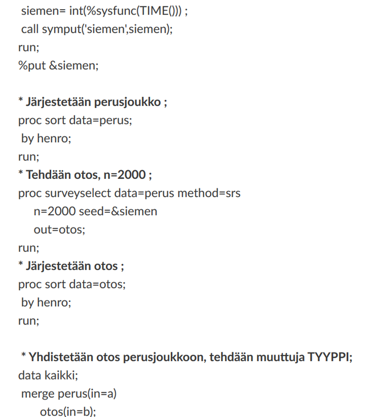
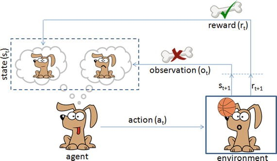

<hero-icon heroIcon='chap4'/>

<text-box>

Imagine a facial recognition system called MYFACE. MYFACE is used for security purposes in the airport. Usually it works perfectly, but one day it starts to miscategorize individuals as potentially dangerous. As a result, several innocent people are arrested. Would it be important to know why the system made all these mistakes? Should we be able to explain why it made mistakes? And why would this matter?

-- picture --

</text-box>

<styled-text>

Some contemporary machine learning systems are so-called “black box” systems, meaning we can’t really see how they work.  This “opacity”, or lack of visibility, can be a problem if  we use these systems to make decisions that have an effect on individuals.

Individuals have a right to know how critical decisions – such as who gets accepted for a loan application, who gets paroled, and who gets hired – are made. This has led many to call for “more transparent AI”.

### I. Transparency in AI

Transparency is a property of a system that makes it possible to get certain information regarding a system’s inner workings. But what information that is, and whether it is ethically relevant, depends largely on the ethical issue we are trying to answer. Transparency itself is ethically neutral and is not an ethical concept. Instead, it constitutes an ideal. Transparency is something that can manifest in many different ways, and something that can present a solution for underlying ethical questions. In this sense,  transparency is relevant at least to the three following issues:

**1) The justification of decisions.** Good governance in public or private sectors involves non-arbitrariness of decisions. This is applied to any kind of decision-making that has an ethically or legally    relevant effect on individuals. Non-arbitrariness means access to justifications about “why was this decision reached, and on what grounds?” Furthermore, especially in the case of public governance, the capacity to   contest and appeal are crucial. This represents a demand to right wrongs.

**2) A right to know. According to human rights**, people are entitled to have explanations on how decisions were made so that they can maintain genuine agency, freedom and privacy (for more on human rights, see chapter 5). Freedom entails the right to get answers to questions such as “How am I being tracked? What kind of inferences are being made about me? And how, exactly, have the inferences about me been made?”

**3) A moral obligation to understand the consequences of our actions**. As a community, we also have a responsibility for managing risks. There is a moral obligation, up to some reasonable level, to understand and predict the consequences of the kinds of technologies one brings into the world. That is, saying “we can’t understand now what it will do” is not a valid argument for unleashing a system that causes harm. Instead, it is our moral duty to explore the possible risks.

These three points can all be summarized as calls for sufficient information. Do we know whether and to what extent this algorithmic decision is justified? Do I know how inferences about me are made? To what extent I am responsible for the actions of the system, and how much I should know about the inner workings of the system to be able to take that responsibility?

### II. What is transparency?

Transparency can be defined in multiple ways. There are a number of neighboring concepts that are sometimes used as synonyms for transparency – including “explainability” (AI research in this area is known as “XAI”), “interpretability”, “understandability”, and “black box”.

Transparency is, roughly, a property of an application. It is about how much it is possible to understand about a system’s inner workings “in theory”.  It can also mean the way of providing explanations of algorithmic models and decisions that are comprehensible for the user. This deals with the public perception and understanding of how AI works. Transparency can also be taken as a broader socio-technical and normative ideal of “openness”.

There are many open questions regarding what constitutes transparency or explainability, and what level of transparency is sufficient for different stakeholders (Matsakis, 2018). Depending on the specific situation, the precise meaning of “transparency” may vary. It is an open scientific question, whether there are several different kinds, or types, of transparency. Moreover, transparency can refer to different things whether the purpose is to, say, analyze the legal significance of unjust biases or to discuss them in terms of features of machine learning systems.

### III. Transparency as a property of system

As a property of a system, transparency addresses how a model works or functions internally. Transparency is further divided into “simulatability” (an understanding of the functioning of the model), “decomposability” (understanding of the individual components), and algorithmic transparency (visibility of the algorithms).

</styled-text>

<text-box name="What makes a system a “black box”?" icon="chap4">

Complexity. In contemporary AI-systems, operation of a neural network is encoded in thousands, or even millions, of numerical coefficients. Typically the system learns their values at the training phase. Because the operation of the neural network depends on the complicated interactions between these values, it is practically impossible to understand how the network works even if all the parameters are known.
Difficulty of developing explainable solutions. Even if the used AI models support some level of explainability, additional development is required to build explainability to the system. It may be difficult to create a user experience for careful yet easily understandable explanations for the users.

Risk concerns. Many AI algorithms can be fooled if an attacker carefully designs an input that causes the system to malfunction. In a highly transparent system, it may be easier to game the system to come up with strange or unwanted results. Thus, sometimes systems are intentionally designed as black boxes.

</text-box>

<styled-text>

Given that many of the most efficient, current deep learning models are black box models (almost by definition), researchers seem to assume it is highly unlikely that we would be able to develop them as fully transparent. Because of this, the discussion focuses on finding the “sufficient level of transparency”. Would it suffice if algorithms offered people a disclosure of how algorithms came to their decision and provide the smallest change “that can be made to obtain a desirable outcome” (Wachter et al., 2018)? For example, if an algorithm refuses someone a social benefit, it should tell the person the reason, and also what he or she can do to reverse the decision (Matsakis 2018).

The explanation should tell, for instance, what the maximum amount of salary to be approved is (input), and how decreasing the amount will impact the decisions made (manipulation of the input). But the problem is that the right to know also applies to situations where the system makes mistakes. Then, it may be necessary to perform an autopsy on the algorithm and identify those factors that caused the system to make mistakes (Rusanen & Ylikoski 2017). This can’t be done by only manipulating the inputs and outputs.

-- picture: autopsy --

Moreover, transparency serves many other functions in contemporary debates on machine learning models. It can be relevant for developing legislation or for ensuring public trust in AI. To handle these issues the notion of transparency in AI is typically given a wider definition in terms of “comprehensibility”.

### IV. Transparency as comprehensibility

The comprehensibility – or understandability – of an algorithm requires that one should explain how a decision was made by an AI model in a way that is sufficiently understandable to those affected by the model. One should have a concrete sense of how or why a particular decision has been arrived at based on inputs.

However, it is notoriously difficult to translate algorithmically derived concepts into human-understandable concepts. In some countries, legislators have discussed whether public authorities should publish the algorithms they use in automated decision-making in terms of programming codes. However, most people do not know how to make sense of programming codes. It is thus hard to see how transparency is increased by publishing codes.

Would it be more helpful to publish the exact algorithms? In most cases, publishing the exact algorithms does not bring a lot of transparency either, especially if you do not have the access to the data used in a model.

Pic: ALGORITHM

Nowadays, cognitive and computer scientists develop human-interpretable descriptions of how applications behave, and why. Approaches include, for example, the development of data visualization tools, interactive interfaces, verbal explanations or meta-level descriptions of the features of models. These tools can be extremely helpful for making AI applications more accessible. However, there is still plenty of work to be done.

Example of a visualization technique
KUVA

The fact that comprehensibility is based on subject and culture-dependent components complicates this more. For example, the logic of how visualizations are interpreted – or how the inferences are made on them – varies across cultures. Thus, tech developers should pay attention to the sufficient understanding of the visual language they use.

Moreover, much is dependent on the degree of data or algorithmic literacy, for example the knowledge of contemporary technologies. In some cultures, the vocabulary of contemporary technology is more familiar, but in many others they may be completely novel. To increase the understandability, there is clearly a need for significant educational efforts in improving algorithmic literacy – for example on “computational thinking” (Heintz, Mannila, & Färnqvist, 2016). This user literacy will have a direct effect on transparency in terms of the ordinary users’ basic understanding of AI systems. It may actually provide the most efficient and practical way to make the boxes less black for many people.

</styled-text>

<text-box name="How to make models more transparent?" icon="exerIcon">

The black box problem of artificial intelligence is not new. Providing transparency for machine learning models is an active area of research. Roughly speaking, there are five main approaches:

* **Use simpler models**. This, however, often sacrifices accuracy for explainability.

* **Combine simpler and more sophisticated models**. While the sophisticated model allows the system to do more complex computations, the simpler model can be used to provide transparency.

* **Modify inputs to track relevant dependencies between inputs and outputs**. If a manipulation of inputs changes overall model results, these inputs may play a role in the classification.

* **Design the models for the user**. This requires using cognitively and psychologically efficient methods and tools for visualizing the model states or directing attention. For example, in computer vision, states in intermediate layers of the models can be visualized as features (like heads, arms, and legs) to provide a comprehensible description for image classification. Researchers have also developed methods for directing “attention” towards the parts of the input that matter the most. These can be visualized to highlight the parts of an image or a text (so-called “weights”) that contribute the most to a particular recommendation.

* **Follow the latest research**. A lot of research is ongoing on various aspects of explainable AI – including the socio-cognitive dimensions – and new techniques are being developed.

</text-box>

<styled-text>

### V) Transparency and the risks of openness

Transparency often denotes a modern, ethico-socio-legal “ideal” (Koivisto 2016), a normative demand for the acceptable use of technology in our societies. It is a reflection of the ideal of “openness”, that is framed in terms of “open government”, “open data”, “open source/code/access”, as well as “open science” (Larsson 2020). In this way, transparency considerations are needed to mitigate the equal distribution of scientific advancements so that the benefits of AI development can be made accessible for all people.

</styled-text>

<text-box>

Paradoxically, the ideal of openness can lean to harmful consequences, too. For example, the transparency of social media platforms has led to several instances of misuse and democratic challenges. Transparency can create security risks. Too much transparency may lead to leaking of privacy-sensitive data into the wrong hands. Or the more that is revealed about the algorithms and the data, the more harm a malicious actor can cause. Algorithms can be hacked, and information may make AI more vulnerable to intentional attacks. Entire algorithms can also be stolen based simply on their explanations alone.

</text-box>

<styled-text>

In summary, while there is a need to develop more transparent practices for AI, there is also a need to  develop practices that can help us to avoid abuse. While transparency may help to mitigate ethical issues – such as fairness or accountability – it also creates ethically important risks. Too much openness in the wrong context may defeat the positive development of AI-enabled processes. Taken together, it is clear that the ideal of full transparency of algorithms should be carefully considered, and we will have to find a balance between security and transparency considerations.

</styled-text>

<quiz id="f94f13d3-3983-4d86-811c-881e1282c275">

There is a need to translate algorithmic concepts into everyday language. Most people without a  background in computer science are not familiar with the basic vocabulary of AI. This has a direct impact on their ability to understand recent developments.

 

Compare these three visualizations of reinforcement learning algorithms. Which one of them is the most understandable? Why?

 

 </quiz>
