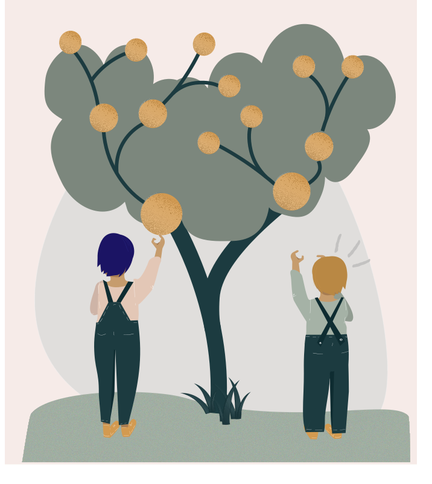

<hero-icon heroIcon='chap6'/>

<styled-text>

When it comes to fairness, equality and equity mean different things. 

 

Philosophers have proposed various definitions for the concept of fairness. According to Aristotle, “equals should be treated equally and unequals unequally”.

This principle of equality states that individuals should be treated the same, unless they differ in ways that are relevant to the situation in which they are involved.

For example, if Alan Turing and Ada Lovelace both got the same grades from the exams, and there are no relevant differences between them or the exams they take, then they should be given the same grade. And if Turing would get a better grade than Lovelace simply because he has a higher socio-economic status, then it would be unfair. Why? Because socio-economic status should not be relevant when grades are given.

However, the principle of equality has been criticized for being “blind”. The principle does not take into account that not every one of us starts from the same position, or that there are individual differences that matter. In contrast to equality, “equity” does not promote fairness by treating categorically everybody the same, but by giving everybody equal access to the same opportunities. For example, there are situations where the differences in socio-economic background is a relevant criteria for treating people differently. For example, most people accepted it as fair when the government gives social benefits only to those citizens that really need them, and does not provide benefits to all.

**Equality** means, that everybody is treated the same.

**Equity** means, that everybody gets what they need to be successful.

On the other hand, there are also criteria that are not justifiable grounds for giving people different treatment. For example, we generally hold that it is unfair to give individuals special treatment on the basis of age, sex, race, or their religious preferences. What is discrimination, in other words?

</styled-text>

<text-box variant='hint' name='Different kinds of justice'>

**Distributive justice** means the extent to which society’s institutions ensure that benefits and burdens are distributed among society’s members in ways that are fair and just.

**Retributive justice** means the extent to which punishments are fair and just. In general, punishments are held to be just to the extent that they take into account relevant criteria such as the seriousness of the crime and the intent of the criminal, and discount irrelevant criteria such as race.

**Compensatory justice** means the extent to which people are fairly compensated for their injuries by those who have injured them; just compensation is proportional to the loss inflicted on a person. This is precisely the kind of justice that is at stake in debates over damage to workers’ health in coal mines. Some argue that mine owners should compensate the workers whose health has been ruined. Others argue that workers voluntarily took on this risk when they chose employment in the mines.

</text-box>
