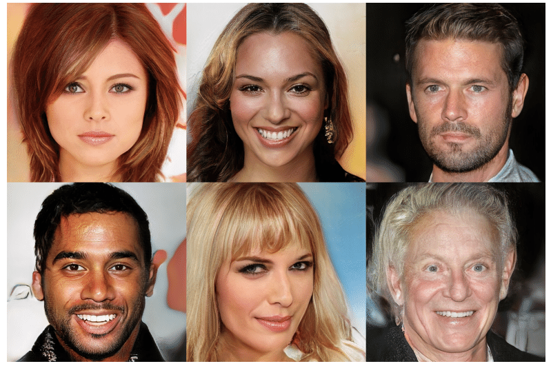

<hero-icon heroIcon='chap1'/>

<styled-text>

Perinteisesti teknologian kehittämisessä on tyypillisesti keskitytty teknologioiden toimivuuteen, käytettävyyteen, tehokkuuteen ja luotettavuuteen. Tekoälyteknologia edellyttää kuitenkin laajempaa keskustelua yhteiskunnallisesta hyväksyttävyydestään. Tekoälyteknologia vaikuttaa moraalisiin (ja poliittisiin) näkökohtiin. Se muokkaa yksilöitä, yhteiskuntia ja näiden ympäristöjä tavalla, jolla on eettisiä vaikutuksia.

Eettisesti merkityksellisten käsitteiden tulkinta voi muuttua teknologioiden myötä (mieti, mitä ”yksityisyys” tarkoitti ennen sosiaalista mediaa). Kun uusia tekniikoita otetaan käyttöön, käyttäjät käyttävät niitä usein myös muihin kuin alun perin tarkoitettuihin tarkoituksiin. Tämä uudistaa eettistä toimintaympäristöä ja pakottaa meidät pohtimaan ja analysoimaan teknologian eettistä perustaa yhä uudelleen.

### Eettiset kehykset

Eettisillä kehyksillä pyritään rakentamaan konsensusta niiden arvojen ja normien perustalle, jotka yhteisö voi hyväksyä – olipa kyse sitten yksilöiden ryhmästä, kansalaisista, valtioista, data-alan yrityksistä tai muista sidosryhmistä.

Eri organisaatiot ovat osallistuneet tekoälyn eettisen kehyksen kehittämiseen. Luonnollisesti näkemykset ovat joiltain osin erilaisia, mutta myös niistä ollaan pääsemässä yksimielisyyteen. Tuoreen tutkimuksen (Jobin ym. 2019) mukaan tekoälyn etiikassa on melko nopeasti päästy yhteneväiseen näkemykseen seuraavista viidestä periaatteesta:

* vahinkojen välttäminen
* vastuullisuus
* läpinäkyvyys ja selitettävyys
* oikeudenmukaisuus
* ihmisoikeuksien, kuten yksityisyyden ja turvallisuuden, kunnioittaminen.

 </img>

Tekoälyn etiikan viisi periaatetta vastaavat eri kysymyksiin ja keskittyvät eri arvoihin:

1. Pitäisikö meidän käyttää tekoälyä hyvään eikä haitan aiheuttamiseen? (hyvää tekemisen periaate / vahinkojen välttämisen periaate)
2. Ketä pitäisi syyttää, kun tekoäly aiheuttaa haittaa? (vastuullisuusperiaate)
3. Pitäisikö meidän ymmärtää, mitä tekoäly tekee ja miksi tekoäly tekee sen, mitä se tekee? (läpinäkyvyyden periaate)
4. Pitäisikö tekoälyn olla oikeudenmukaista tai syrjimätöntä? (oikeudenmukaisuuden periaate)
5. Pitäisikö tekoälyn kunnioittaa ja edistää ihmisoikeuksia? (perusihmisoikeuksien kunnioittamisen periaate)

</styled-text>

<styled-text>

Kurssin jäljellä olevissa osissa keskitytään näihin tekoälyn etiikan periaatteisiin. Ensin analysoimme, mitä nämä käsitteet tarkoittavat ja miten niitä voidaan tulkita perinteisen filosofian mukaisella käsiteanalyysilla. Lisäksi perehdymme siihen, miten näitä käsitteitä sovelletaan käytännössä, käsittelemme niihin liittyviä ongelmia ja tuomme esiin joitakin näitä periaatteita koskevia avoimia kysymyksiä.

Kurssin viimeisessä osassa tarkastelemme tekoälyn etiikan hanketta kokonaisuutena. Esitämme ”cui bono” -kysymyksen: kenelle tekoälyn etiikka on tarkoitettu, ja ketkä tai mitä jätetään ulkopuolelle?

Lisäksi on todettava, että tekoälystä ja sen sosiaalisista vaikutuksista puhuttaessa tekoälyn etiikka on ensimmäisellä sijalla. On kuitenkin myös muita teoreettisia kehyksiä, joita voidaan käyttää algoritmien ja dataohjattujen järjestelmien eettisten sääntöjen tarkasteluun. Esimerkiksi tekoälyn sosiaalisiin vaikutuksiin liittyviä kysymyksiä tulee esiin muun muassa algoritmisissa kulttuureissa, sukupuolentutkimuksissa ja mediatutkimuksissa. Vastaavasti ihmisen ja koneen välisen vuorovaikutuksen kognitiiviset ja psykologiset näkökohdat muovaavat kysymystä tekoälyn tarkoituksenmukaisesta eettisestä kehyksestä. Tekoälyn etiikka käsittää siis paljon muutakin kuin datan tai algoritmien etiikan.

</styled-text>

<quiz id="2330edb7-5a0b-5c28-b6c0-19ac68494137">

Kuvittele, että jonakin päivänä päädyt kiivaaseen keskusteluun Twitterissä. Keskustelu alkaa yliopiston professorin (@TuringLives) tviitillä, joka koskee kuvankäännösmallia. Se poisti syötteenä olleesta pääministeri Sanna Marinin kuvasta pikselöinnin ja muutti kuvan samalla keski-ikäisen valkoisen miehen kuvaksi:

 

Huom. Tämä ei ole todellinen tekoälypohjainen valokuvien luontitapaus.  
Kuva 1: CC BY 4.0 Laura Kotila / Valtioneuvoston kanslia (muokattu alkuperäisestä) 
Kuvat 2 ja 3 ovat taiteilijan näkemyksiä. 
Kuva 4: CC BY-NC 4.0 NVIDIA Corporation  

**Mitä kuvankäännösalgoritmit ovat?**

Monet tunnetuimmista kuvankäännöksistä ovat generatiivisen kilpailevan neuroverkon (generative adversarial network, GAN) tuottamia. GAN on generatiiviseen mallintamiseen käytettävä neuroverkkoarkkitehtuuri.

GANissa kaksi verkkoa kilpailevat keskenään. Toinen verkoista on esimerkiksi opetettu generoimaan kuvia, jotka muistuttavat opetusdataan kuuluvia kuvia (esimerkiksi kissojen tai ihmiskasvojen kuvia). Toisen verkon (eli kilpailevan verkon) tehtävänä on erottaa ensimmäisen verkon generoimat kuvat opetusdataan kuuluvista aidoista kuvista.

Järjestelmä opettaa näitä kahta verkkoa rinnakkain. Opetuksen ensimmäisessä vaiheessa kilpailevan verkon tehtävänä on erottaa opetusdataan kuuluvat aidot kuvat generatiivisen verkon tuottamista kehnoista ehdotuksista. Koska generatiivinen verkko kuitenkin oppii vähitellen yhä paremmaksi, myös kilpailevan verkon on muututtava paremmaksi. Kilpailu jatkuu, ja lopulta on lähes mahdotonta erottaa generoituja kuvia aidoista kuvista. (Lisätietoa GANista saat tekoälyn perusteiden verkkokurssilta.)

GANit eivät tyydy tuottamaan pelkästään opetusdataan kuuluvia kohteita, vaan järjestelmä opetetaan niin, että se pystyy tuottamaan uusia, aidonnäköisiä kohteita, kuten kuvia. GANit – kuten monet muut nykyiset algoritmit – tuottavat kuitenkin tuloksia, jotka heijastavat syöttötietojen tilastollisia malleja.

Seuraavat kuvat ovat kehittäneet Tero Karras, Samuli Laine, Timo Aila ja Jaakko Lehtinen NVIDIA Research Helsingin tutkimusprojektissa ([lisätietoa on tässä artikkelissa](https://research.aalto.fi/en/publications/progressive-growing-of-gans-for-improved-quality-stability-and-va)).

 

 

GANeja voidaan käyttää monissa tarkoituksissa, kuten käännettäessä yökuvia päiväkuviksi tai luotaessa fotorealistisia valokuvia erilaisista kohteista, kuten esineistä, näkymistä tai ihmisistä.

Lisätietoa GANien toiminnasta: http://gandissect.res.ibm.com/ganpaint.html

Seuraavaksi osallistut Twitter-keskusteluun. Tehtäväsi on vastata näihin tviitteihin muotoilemalla oma näkemyksesi asiasta.

 

 

> @TuringLives: ”Nykyiset kasvokuvien generointijärjestelmät vain tekevät näin. Jos algoritmeja opetetaan valkoisten miesten kuvilla, algoritmit tuottavat kuvia valkoisista miehistä. Niin ne toimivat.”

> @AdaLovelace: ”Tämä on esimerkki tärkeämmästä kysymyksestä: Algoritmiemme piilevistä vaaroista. Algoritmiemme piilevistä vinoumista. Haluaisitko, että tällaiset algoritmit päättävät, kuka saa työpaikan, kuka pidätetään tai kuka läpäisee turvatarkastuksen lentokentillä? Minä en halua.”

> @TuringLives: ”Näin nämä järjestelmät toimivat. Nämä algoritmit tuottavat vinoutuneita tuloksia, jos niitä opetetaan vinoutuneella datalla. Kasvokuvien generointijärjestelmät saavat kaikki näyttämään valkoisilta miehiltä, jos ne opetetaan valkoisten miesten kuvia sisältävillä tietoaineistoilla.”

> @EugeneG: ”Ongelma ei ole kuitenkaan siinä. Kyse ei todellakaan ole tietoaineistoista, vaan koko koneoppimisalasta. Älä pelkistä tämän alan aiheuttamia haittoja tietoaineiston vinoumiksi.”

> @TuringLives: ”En tehnytkään niin. Sanoin vain, että jos käytämme vinoutuneita tietoaineistoja, saamme vinoutuneita tuloksia. Siksi tutkijoiden on valittava datansa huolellisemmin, jotta he eivät vahingossa koodaa tällaisia vinoumia. Lisäksi on eri asia tehdä tutkimusta kuin ottaa nämä menetelmät käyttöön tosielämän sovelluksissa. Meidän pitäisi olla huolissamme vinoumista käytännön sovelluksissa, ei vinoumista akateemisessa tutkimuksessa.”

> @Gödel´sGhost: ”Käyttäjät saavat sovelluksensa insinööreiltä, insinöörit saavat menetelmänsä tietojenkäsittelytieteilijöiltä. Ainakin tietojenkäsittelytieteilijöiden pitäisi tunnustaa, kuinka vinoutuneita heidän menetelmänsä ovat. Ja kertoa se.”

> @TuringLives: ”Kyllä, olen samaa mieltä. Mutta eikö ole eri asia tutkia näitä asioita kuin ottaa ne käyttöön käytännössä? Vinoumien seuraukset ovat ongelmallisempia esiintyessään käytössä olevassa tuotteessa kuin esiintyessään akateemisessa artikkelissa. Älä hauku väärää puuta.”

> @TheManIntheChineseRoom: ”Joten periaatteessa sanot, että tutkijat saattavat myöntää datansa olevan vinoutunutta ja käyttää sitä joka tapauksessa, koska se on saatavilla, ja todeta sitten, että ’se on hyväksyttävää, koska kyse on vain akateemisesta kokeesta, ja en ole vastuussa, jos joku käyttää sitä haittaa aiheuttavalla tavalla’. Onko tämä vastauksesi?”

> @TuringLives: ”Kyllä ja ei. Eikö perustutkimuksen ja tosielämän tehtävissä tapahtuvan sovellusten käytön välillä ole eroa? Mietipä fyysikoita. Ovatko fyysikot vastuussa ydinaseista? Tai ovatko biologit vastuussa eugeniikasta? Eikö tässä ole kyse täsmälleen samasta asiasta? Voimmeko tuomita perustutkimuksen sen perusteella, että sovellukset voivat olla pahoja? Myönnän silti, että vinoumat ovat merkittävä huolenaihe, mutta tosielämän sovellusten osalta.”

Miten vastaisit? Keksi itsellesi Twitter-nimimerkki ja kirjoita vastauksesi jäljempänä olevaan tilaan.

</quiz>

<quiz id="bd3c293d-961d-5c88-8ae0-609d251fbf20"> </quiz>

<quiz id="9720570a-d33b-5f7e-a42b-55c3eb689595"> </quiz>
