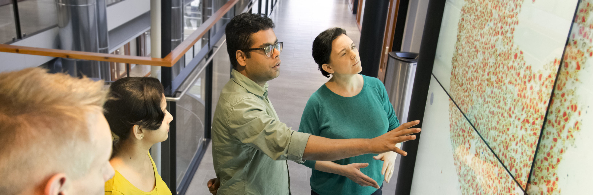

<hero-icon heroIcon='chap2'/>

 </img>

Kuvitus. © Keksi Agency Helsingin kaupungin viestintäosaston välityksellä

<styled-text>

Oletetaan, että olet Helsingin kaupungin digijohtaja. Sinua pyydetään pohtimaan, pitäisikö kaupungin terveydenhuollon organisaation siirtyä ”reagoivasta” terveydenhuollosta ”ehkäisevään” terveydenhuoltoon. Luet erään raportin. Siinä kerrotaan uusista, kehittyneistä koneoppimisjärjestelmistä, jotka auttaisivat terveysviranomaisia ennustamaan kansalaisten mahdollisia terveysriskejä.

Nämä menetelmät tuottavat ennusteita yhdistämällä ja analysoimalla erilaisia lääketieteellisten ja terveydenhuollon järjestelmien lähteitä. Analysoimalla suuren määrän kriteeritietoja korkean riskin henkilöt voitaisiin tunnistaa ja asettaa etusijalle. Nämä riskialttiit henkilöt voitaisiin kutsua ennakoivasti lääkärin vastaanotolle saamaan asianmukaista hoitoa.

**Hyödyt**

Raportissa mainitaan monia etuja. Esimerkiksi sairauksien ehkäisy tarjoaa paljon mahdollisuuksia parantaa kansalaisten terveyttä ja elämänlaatua. Lisäksi sairauksien ehkäisy mahdollistaisi paremman vaikutusten arvioinnin ja perusterveydenhuollon palvelujen suunnittelun. Ehkäisevä terveydenhuolto voisi myös vähentää sosiaali- ja terveydenhuollon kustannuksia merkittävästi. Raportissa korostetaan, että näitä säästöjä voitaisiin käyttää yhteiseen hyvään.

**Mahdolliset ongelmat**

Raportissa esitetään kuitenkin myös joitakin huolenaiheita. Järjestelmiin liittyy esimerkiksi useita oikeudellisia ja eettisiä kysymyksiä, jotka koskevat yksityisyyttä, turvallisuutta ja tietojen käyttöä. Raportissa kysytään esimerkiksi, missä on hyväksyttävän ennaltaehkäisyn ja sellaisen puuttumisen välinen raja, jota ei voida pitää hyväksyttävänä. Onko kaupungilla oikeus käyttää yksityisiä, arkaluonteisia lääketieteellisiä tietoja riskipotilaiden tunnistamiseen? Miten suostumus annetaan, ja mitä tapahtuu ihmisille, jotka eivät anna suostumustaan? Entä mitä tapahtuu niille ihmisille, jotka eivät anna suostumustaan, koska he eivät pysty siihen?

Raportissa tuodaan esiin myös peruskysymys kaupungin roolista: jos kaupungilla on tietoa mahdollisista terveysriskeistä eikä se toimi tietojen perusteella, syyllistyykö kaupunki laiminlyöntiin? Kohdellaanko kansalaisia yhdenvertaisesti fyysisessä ja digitaalisessa maailmassa? Jos henkilö menettää tajuntansa tosielämässä, soitamme ambulanssin ilman nimenomaista lupaa siihen. Digitaalisessa maailmassa yksityisyydensuojaan liittyvät näkökohdat voivat estää meitä ottamasta yhteyttä kansalaisiin.

Mitä mieltä olet edellä olevasta esimerkistä? Tukisitko digijohtajana ennaltaehkäisevien menetelmien käyttöä? Jos vastaat esimerkiksi ”kyllä, kaupungin pitäisi etsiä eettisesti ja oikeudellisesti hyväksyttävä tapa käyttää näitä menetelmiä – käytöllä on niin paljon etuja verrattuna mahdollisiin riskeihin”, käytit todennäköisesti moraalista päättelyä, jota kutsutaan ”utilitarismiksi”.

</styled-text>

<text-box name="Utilitarismi" icon="exerIcon">

**Utilitarismi** on eettisten teorioiden ryhmä. Siinä pidetään ”hyötyjä” tekoina, jotka maksimoivat kaikkien niiden hyvinvoinnin, joita teot koskevat. Utilitarismi on seurausetiikan muoto. Seurausetiikan mukaan teon oikeus tai vääryys määräytyy aina vain teon seurausten mukaan.

</text-box>

<styled-text>

Utilitaristien mukaan moraalisesti oikeat teot ovat tekoja, jotka tuottavat suhteessa haittaan suurimmat hyödyt kaikille, joita teot koskevat. Toisin kuin muissa individualistisemmissa seurausetiikan muodoissa (kuten egoismissa) tai epätasaisesti painottavassa seurausetiikassa (kuten prioritarismissa), utilitarismissa otetaan kaikkien ihmisten edut tasapuolisesti huomioon. Utilitaristit ovat kuitenkin eri mieltä monista erityiskysymyksistä, kuten siitä, pitäisikö teot valita niiden todennäköisten tulosten perusteella (tekoutilitarismi) vai pitäisikö toimijoiden noudattaa sääntöjä, jotka maksimoivat utiliteetin (sääntöutilitarismi). Erimielisyyttä on myös siitä, pitäisikö kokonaisutiliteetti (totaaliutilitarismi), keskimääräinen utiliteetti (keskiarvoutilitarismi) vai vähimmäisutiliteetti maksimoida.

Utilitaristeille utiliteetti – tai hyöty – tarkoittaa hyvinvointia tai onnellisuutta. Esimerkiksi utilitarismin isä Jeremy Bentham luonnehti utiliteettia sellaiseksi, joka yleensä tuottaa hyötyä, etua, mielihyvää, hyvää tai onnellisuutta tai estää ilkivallan, tuskan, pahan tai onnettomuuden aiheutumisen sille osapuolelle, jonka etu on kyseessä.

Utilitarismi tarjoaa melko yksinkertaisen menetelmän päättää, onko teko moraalisesti oikein vai ei. Jos haluamme tietää, mitä meidän pitäisi tehdä, toimimme seuraavasti:

* Ensin yksilöimme eri teot, jotka voisimme tehdä.
* Toiseksi arvioimme hyödyt ja haitat, joita jokaisesta teosta aiheutuisi.
* Kolmanneksi valitsemme teon, jolla saamme suurimmat hyödyt sen jälkeen, kun kustannukset on otettu huomioon.

Utilitarismissa esitetään monia mielenkiintoisia ideoita ja käsitteitä. Esimerkiksi ”laskevan rajahyödyn” periaatetta voidaan käyttää monissa yhteyksissä. Periaatteen mukaan yksiköstä saatava hyöty vähenee, kun yksiköiden tarjonta kasvaa (ja päinvastoin).

Kun esimerkiksi alat kuntoilla, hyödyt ovat aluksi suuret ja tuloksesi paranevat huomattavasti. Mitä kauemmin jatkat kuntoilua, sitä pienempi vaikutus on kuitenkin jokaisella yksittäisellä harjoituskerralla. Jos harjoittelet liian usein, hyöty vähenee ja alat kärsiä ylikunnon oireista.

Toinen esimerkki on, että jos syöt yhden makeisen, saat paljon nautintoa. Jos taas syöt liikaa makeisia, saatat saada diabeteksen. Tämä hyötyparadoksi olisi aina muistettava, kun arvioidaan tekojen seurauksia. Se, mikä on yhteinen hyvä nyt, ei välttämättä ole yhteinen hyvä tulevaisuudessa.

## Utilitarismin ongelmat

Utilitarismi ei ole täydellinen kuvaus moraalisesta päätöksenteosta. Utilitarismia on arvosteltu monella perusteella. Esimerkiksi utilitaristinen laskenta edellyttää, että teoista aiheutuville hyödyille ja haitoille annetaan arvot ja niitä verrataan muiden tekojen mahdollisiin seurauksiin. Usein on kuitenkin vaikeaa tai jopa mahdotonta mitata ja vertailla kaikkien merkityksellisten hyötyjen ja kustannusten arvoja etukäteen.

</styled-text>

”Riskillä” tarkoitetaan yleensä sellaisen vaaran tai vahingon todennäköisyyttä, joka syntyy aavistamatta, tai teknisemmässä mielessä jonkinasteista haitan todennäköisyyttä. Tekoälyn etiikassa haittojen ja riskien katsotaan aiheutuvan teknologian suunnittelusta, epäasianmukaisesta soveltamisesta tai tarkoituksellisesta väärinkäytöstä. Tyypillisiä esimerkkejä riskeistä ovat muun muassa syrjintä, yksityisyyden loukkaaminen, turvallisuusongelmat, kybersodankäynti tai ilkivaltainen hakkerointi. Käytännössä riskejä ja hyötyjä on vaikea vertailla seuraavista syistä:

**Ensinnäkin** riskeihin ja hyötyihin vaikuttavat arvositoumukset, subjektiiviset ja erilaiset mieltymykset, käytännön olosuhteet sekä henkilökohtaiset ja kulttuuriset tekijät.

**Toiseksi** haitat ja hyödyt eivät ole muuttumattomia. Yksikön rajahyöty vähenee tavalla, jota voi olla vaikea ennakoida. Lisäksi tietyllä haitalla tai hyödyllä voi olla erilainen hyötyarvo eri olosuhteissa. Esimerkiksi se, onko nopeampi auto hyödyllisempi, riippuu sen käyttötarkoituksesta. Jos auto on tarkoitettu koulubussiksi, etusijalle olisi asetettava turvallisuus, mutta jos autoa käytetään kilpa-autona, vastaus saattaa olla erilainen.

**Kolmanneksi** reaalimaailman tilanteet ovat tyypillisesti niin monimutkaisia, että kaikkia riskejä ja hyötyjä on vaikea ennakoida tai vertailla etukäteen. Analysoidaan esimerkiksi sotarobotiikan mahdollisia seurauksia. Vaikka nykyiset sotarobotit ovat pääasiassa kauko-ohjattavia tai puoliautonomisia, ajan mittaan sotaroboteista tulee todennäköisesti täysin autonomisia. Joidenkin arvioiden mukaan robotit vähentävät siviili- ja sotilasuhreja. Toisten arvioiden mukaan robotit eivät kuitenkaan vähennä siviileihin kohdistuvaa riskiä. Tilastojen mukaan robottiaseet ovat olleet 2000-luvun ensimmäisten vuosikymmenien sotien aikana mukana lukuisissa sekä sotilaiden että siviilien surmissa. Mahdollisuus käyttää erilaisia tekniikoita – kuten hämäys- tai häirintäkuvioita (jotka häiritsevät koneen kykyä luokitella kuvat oikein) – automatisoitujen aseiden huijaamiseen ja manipulointiin hankaloittaa tilannetta lisäämällä siviilien vahingoittumisen riskiä. Kokonaisriskitaso riippuu myös siitä, miten helposti sotia saatettaisiin julistaa, jos robotit kantaisivat suurimman osan fyysisestä riskistä.

**Neljänneksi** utilitarismissa ei oteta huomioon muita moraalisia näkökohtia. On helppo kuvitella tilanteita, joissa kehittynyt teknologia tuottaisi suuria hyötyjä yhteiskunnalle, mutta sen käyttö herättäisi silti merkittäviä eettisiä kysymyksiä. Ajatellaanpa esimerkiksi ehkäisevän terveydenhuoltojärjestelmän tapausta. Järjestelmä voi todellakin olla hyödyllinen monille, mutta se pakottaa silti kysymään, onko perusihmisoikeuksilla, kuten yksityisyydellä, merkitystä. Tai mitä tapahtuu kansalaisen oikeudelle olla tietämätön mahdollisista terveysongelmista? (Monet meistä haluaisivat tietää riskiryhmään kuulumisesta, mutta entä jos joku ei haluakaan tietää? Voiko kaupunki antaa hänelle tiedon siitä huolimatta?) Tai miten voimme varmistaa, että kaikilla on yhtäläiset mahdollisuudet saada ennaltaehkäisevän järjestelmän mahdollisia hyötyjä?

<text-box name="Nozickin utiliteettihirviö" icon="philIcon">

Yksi utilitarismin suurimmista vaikeuksista liittyy utiliteettiin: mikä se oikeastaan on? Teknisesti utiliteetti on vain mitta (numeerinen määrä), joka kuvaa jonkinlaista taustalla olevaa maksimoitavaa ”hyvää”, kuten mielihyvää tai hyvinvointia (jotka hedonististen filosofien mielestä ovat sama asia). Mielihyvä on ainakin jossain määrin subjektiivinen kokemus, ja utiliteetin pitäisi mittana muuttaa se intersubjektiivisesti vertailukelpoiseksi määräksi. Näin korkealle asetettu tavoite on vaikea saavuttaa.

Olettaen, että sellainen mitta kuin utiliteetti on todella olemassa, filosofi Robert Nozick on esittänyt seuraavan ajatuskokeen. On olemassa olento nimeltä utiliteettihirviö. Sen hedonistinen mieli on sellainen, että hirviö saa enemmän nautintoa mistä tahansa resurssista kuin kukaan muu yksilö saisi. Hirviö yksinkertaisesti nauttii esimerkiksi omenoista, autoista, kahvista ja vapaudesta enemmän kuin kukaan muu. Tämä tarkoittaa, että hirviö saa niistä enemmän utiliteettia. Jos olemme moraalisesti velvollisia maksimoimaan resurssien tuottaman utiliteetin, johtopäätös on selvä: meidän on annettava utiliteettihirviölle kaikki, mitä meillä on. Eikä mitään kenellekään muulle.

Tekeekö tämä utilitarismista vastenmielistä? Onko olemassa jokin keino, jolla utilitaristi voisi väittää, että Nozickin esittämä ajatuskoe ei oikeastaan olisi ongelma?

</text-box>

<quiz id="b90c3d3d-f4e0-59b7-9cc4-894d5b5a520d"> </quiz>
