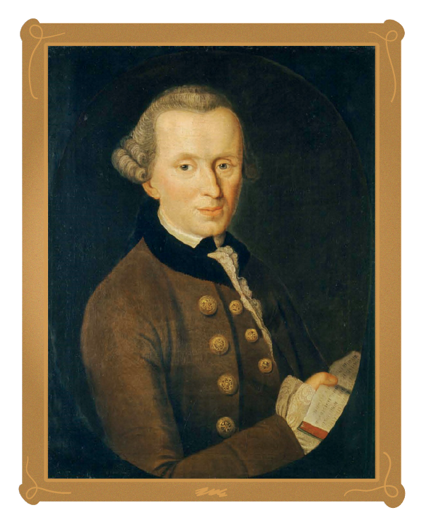

<hero-icon heroIcon='chap3'/>

<styled-text>

Etiikassa vastuullisuus liittyy läheisesti ”moraalisen toimijuuden” käsitteeseen. Moraalinen toimija on toimija, joka pystyy toimimaan ottaen huomioon tekonsa oikeellisuuden tai vääryyden. On tärkeää huomata, että vain moraaliset toimijat ovat moraalisesti vastuussa toiminnastaan.

**Toimiminen ja tekemättä jättäminen**

Filosofisesti moraalinen toimija on ensisijaisesti vastuussa omasta toiminnastaan (”teot”). Joskus toimijat ovat vastuussa myös tekemättä jättämisestä (”tekemättäjättö”). Esimerkiksi jos tappaa jonkun, on vastuussa kyseisestä teosta. Jos vain antaa jonkun kuolla, on vastuussa siitä, että ei auta (tekemättäjättö), vaikka ei aktiivisesti tappanutkaan ketään.

Tekemättäjätöt ja teot eivät ole moraalisesti samanveroisia. On moraalisesti vähemmän pahaa jättää jotakin tekemättä kuin tehdä jotakin: on pahempaa tappaa joku kuin antaa hänen kuolla. Tämä ei kuitenkaan tee tekemättä jättämisestä moraalisesti oikeata. Emme kuitenkaan voi olla vastuussa kaikesta, mitä emme tee. Sen sijaan olemme vastuussa vain siitä, mitä olemme tarkoituksellisesti ja tietoisesti päättäneet tehdä tai jättää tekemättä.

**Autonomia**

Filosofisesti moraalinen vastuu edellyttää 1) moraalista autonomiaa ja 2) kykyä arvioida tekojen seurauksia. ”Moraalisella autonomialla” tarkoitetaan toimijan kykyä soveltaa moraalikoodia itseensä itsenäisesti. Lisäksi autonomia edellyttää

* kykyä päättää toiminnastaan muiden manipuloimatta sitä ja mahdollisuutta toimia ilman ulkoisia tai sisäisiä rajoitteita
* niiden halujen (arvot, tunteet jne.) aitoutta, jotka saavat jonkun toimimaan
* riittäviä kognitiivisia taitoja – eli toimijan on pystyttävä arvioimaan, ennustamaan ja vertailemaan tekojensa seurauksia ja myös arvioimaan toimintaa ohjaavia motiiveja eettisesti mielekkäillä kriteereillä.

</styled-text>

<text-box icon="philIcon" name="Moraalinen vastuu">

Immanuel Kant on tunnetuimpia eurooppalaisia moraalifilosofeja. Immanuel Kantin esittämä käytännöllinen järki – kykymme käyttää järkisyitä valitessamme omia tekojamme – edellyttää, että olemme vapaita. Teot perustuvat omaan tahtoomme käyttää moraalilakia päätöksiemme ohjenuorana. Kantin ja kantilaisten mielestä tämä kyky (soveltaa moraalilakia itseemme) on kaiken moraalisen arvon perimmäinen lähde.

Kantin mukaan meidän onkin osoitettava moraalista kunnioitusta itseämme kohtaan autonomiamme vuoksi. Meidän on kuitenkin osoitettava samanlaista kunnioitusta kaikkia muita ihmisiä kohtaan heidän asemansa vuoksi. Siksi (Kantin kuuluisan kategorisen imperatiivin toisen muotoilun mukaan) meidän on toimittava peruskunnioituksesta muita henkilöitä kohtaan heidän autonomiansa vuoksi. Näin autonomia toimii sekä käytännöllisen järjen mallina moraalista velvoitetta määritettäessä että niiden muiden henkilöiden ominaisuutena, jotka ansaitsevat meiltä moraalista kunnioitusta. (Lisätietoa: [Immanual Kant ja moraalifilosofia](https://en.wikipedia.org/wiki/Categorical_imperative).)

 </img>

</text-box>

<quiz id="2ac3e6e9-9640-5378-8169-3567d2728d8f"> </quiz>
