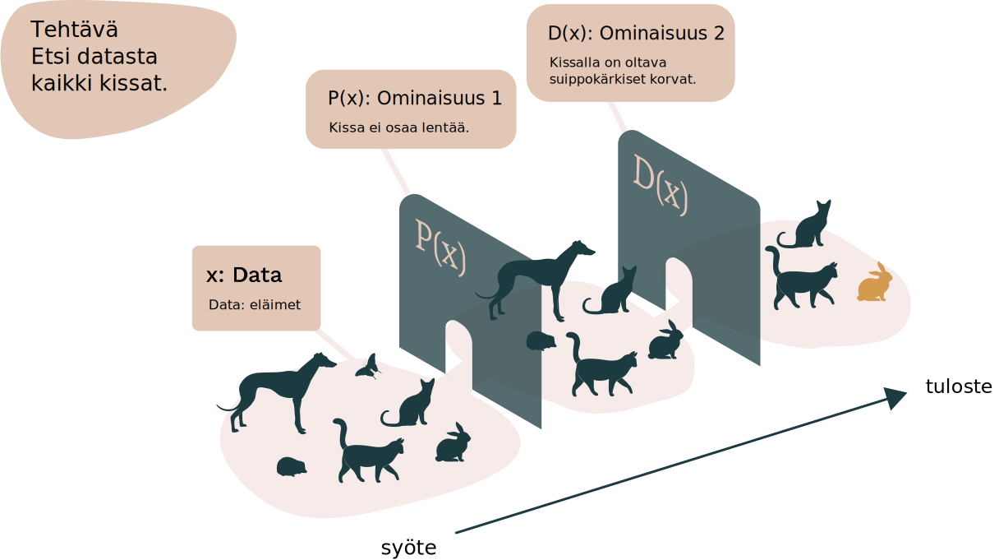
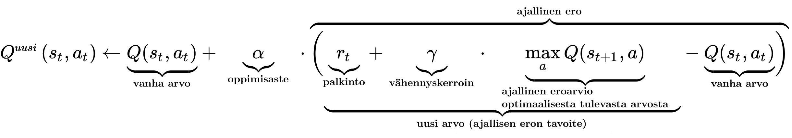
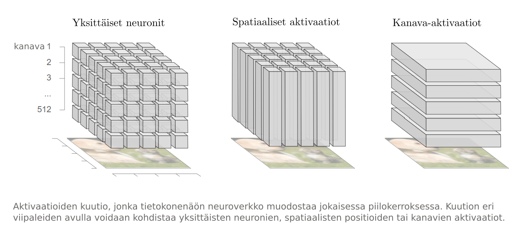
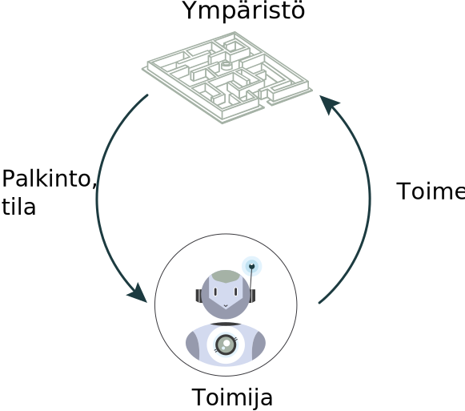
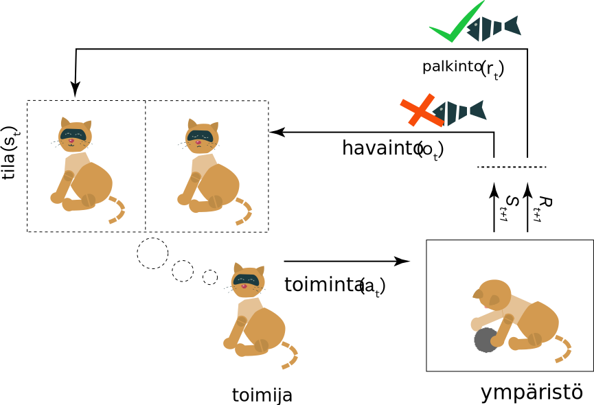

<hero-icon heroIcon='chap4'/>

<styled-text>

Läpinäkyvyys voidaan määritellä monin tavoin. On useita läheisiä käsitteitä, joita käytetään joskus läpinäkyvyyden synonyymeina – esimerkiksi ”selitettävyys” (tämän alueen tekoälytutkimus tunnetaan nimellä ”selittävä tekoäly”), ”tulkittavuus”, ”ymmärrettävyys” ja ”musta laatikko”.

Läpinäkyvyys on karkeasti ottaen sovelluksen ominaisuus. Kyse on siitä, kuinka paljon järjestelmän sisäistä toimintaa on ”teoriassa” mahdollista ymmärtää. Läpinäkyvyys voi myös tarkoittaa tapaa, jolla algoritmisista malleista ja päätöksistä annetaan käyttäjälle ymmärrettäviä selityksiä. Tällöin kyseessä on yleinen käsitys ja ymmärrys tekoälyn toiminnasta. Läpinäkyvyyttä voidaan myös pitää laajempana sosioteknisenä ja normatiivisena ”avoimuuden” ihanteena.

On monia avoimia kysymyksiä siitä, mikä on läpinäkyvyyttä tai selitettävyyttä ja minkä tasoinen läpinäkyvyys riittää eri sidosryhmille. ”Läpinäkyvyyden” tarkka merkitys saattaa vaihdella kunkin tilanteen mukaan. Ratkaisematta on tieteellinen kysymys siitä, onko olemassa useanlaista tai -tyyppistä läpinäkyvyyttä. Lisäksi läpinäkyvyydellä voidaan tarkoittaa eri asioita, kun tarkoituksena on esimerkiksi analysoida epäoikeudenmukaisten vinoumien oikeudellista merkitystä tai keskustella niistä koneoppimisjärjestelmien ominaisuuksien kannalta.

### Läpinäkyvyys järjestelmän ominaisuutena

Kun läpinäkyvyyttä tarkastellaan järjestelmän ominaisuutena, kohteena on mallin sisäinen toiminta. Läpinäkyvyys voidaan jakaa edelleen ”simuloitavuudeksi” (mallin toiminnan ymmärtäminen), ”hajotettavuudeksi” (yksittäisten komponenttien ymmärtäminen) ja algoritmiseksi läpinäkyvyydeksi (algoritmien näkyvyys).

</styled-text>

<text-box name="Mikä tekee järjestelmästä ”mustan laatikon”?" icon="chap4">

**Monimutkaisuus.** Nykyisissä tekoälyjärjestelmissä neuroverkon toiminta koodataan tuhansiin tai jopa miljooniin numeerisiin kertoimiin. Tyypillisesti järjestelmä oppii niiden arvot opetusvaiheessa. Koska neuroverkon toiminta riippuu näiden arvojen monimutkaisista vuorovaikutuksista, verkon toimintaa on käytännössä mahdotonta ymmärtää, vaikka kaikki parametrit olisivatkin tiedossa.

**Selitettävien ratkaisujen kehittämisen vaikeus.** Vaikka käytetyt tekoälymallit tukisivat jonkinasteista selitettävyyttä, järjestelmän selitettävyyden luomiseksi tarvitaan lisäkehitystä. Saattaa olla vaikea luoda käyttäjäkokemusta, joka perustuisi huolellisesti laadittuihin ja silti käyttäjille helposti ymmärrettäviin selityksiin.

**Riskit.** Monia tekoälyalgoritmeja voidaan huijata, jos hyökkääjä suunnittelee huolellisesti syötteen, joka aiheuttaa järjestelmään toimintahäiriön. Erittäin läpinäkyvässä järjestelmässä voi olla helpompi petkuttaa järjestelmää siten, että saadaan outoja tai ei-toivottuja tuloksia. Näin ollen järjestelmät suunnitellaan joskus tarkoituksellisesti mustiksi laatikoiksi.

</text-box>

<styled-text>

Koska monet tehokkaimmista nykyisistä syväoppimismalleista ovat (lähes kokonaan) mustan laatikon malleja, tutkijoiden mielestä näyttää olevan erittäin epätodennäköistä, että niistä pystyttäisiin kehittämään täysin läpinäkyviä. Tämän vuoksi keskustelussa keskitytään ”läpinäkyvyyden riittävän tason” määrittelemiseen. Riittäisikö, jos algoritmit tarjoaisivat ihmisille tietoa siitä, miten ne päätyivät päätökseensä, ja ehdottaisivat pienintä muutosta, joka voidaan tehdä toivottavan lopputuloksen saavuttamiseksi ([Wachter ym., 2018](https://arxiv.org/pdf/1811.01439.pdf))? Jos algoritmi esimerkiksi epää joltakulta sosiaalietuuden, algoritmin pitäisi kertoa henkilölle syy ja myös se, mitä hän voi tehdä päätöksen muuttamiseksi päinvastaiseksi.

Selityksessä olisi esimerkiksi kerrottava, mikä on hyväksyttävä palkan enimmäismäärä (syöte) ja miten määrän pieneneminen vaikuttaa tehtyihin päätöksiin (syötteen manipulointi). Ongelma on kuitenkin se, että oikeus tietää koskee myös tilanteita, joissa järjestelmä tekee virheitä. Silloin voi olla tarpeen tutkia algoritmi läpikotaisin ja selvittää tekijät, jotka aiheuttivat järjestelmän tekemät virheet (Rusanen ja Ylikoski 2017). Tätä ei voida tehdä vain manipuloimalla syötteitä ja tulosteita.

 </img>

Edellä olevassa kuvassa on erittäin yksinkertaistettu tekoälymalli. Sen tehtävä on tunnistaa kaikki kissat tiedoista, jotka koostuvat kaikenlaisista eläimistä. Malli on päätynyt kahteen ominaisuuteen, jotka muodostavat kissan. Mallille ne ovat vain numeroita, mutta meistä ne näyttävät kuvattavissa olevilta ominaisuuksilta. Mallin päättelemät ominaisuudet voivat kuitenkin vaikuttaa meistä melko monimutkaisilta. Lisätietoa on sivustolla https://distill.pub/2017/feature-visualization/.

Lisäksi läpinäkyvyydellä on monia muita tehtäviä koneoppimismalleja koskevissa nykyisissä keskusteluissa. Läpinäkyvyydellä voi olla merkitystä lainsäädännön kehittämisen tai kansalaisten tekoälyä kohtaan tunteman luottamuksen varmistamisen kannalta. Näiden kysymysten käsittelemiseksi tekoälyn läpinäkyvyyden käsite määritellään yleensä laajemmin ”ymmärrettävyydeksi”.

### Läpinäkyvyys ymmärrettävyytenä

Algoritmin ymmärrettävyys – tai käsitettävyys – edellyttää, että tekoälymallin päätöksentekotapa selitetään riittävän ymmärrettävällä tavalla niille, joihin malli vaikuttaa. Meillä pitäisi olla konkreettinen käsitys siitä, miten tai miksi syötteiden perusteella on tehty kulloinenkin päätös.

Algoritmisesti johdettuja käsitteitä on kuitenkin tunnetusti vaikea muuntaa ihmiselle ymmärrettäviksi käsitteiksi. Joissakin maissa lainsäätäjät ovat keskustelleet siitä, pitäisikö viranomaisten julkaista automaattisessa päätöksenteossa käyttämiensä algoritmien ohjelmointikoodit. Useimmat ihmiset eivät kuitenkaan ymmärrä ohjelmointikoodeja. Siksi on vaikea nähdä, miten läpinäkyvyys lisääntyisi koodeja julkaisemalla.

```sas
* Take seed number from machine time for sample;
data _NULL_;
 seedNumber= int(%sysfunc(TIME())) ;
 call symput('seedNumber',seedNumber);
run;
%put &seedNumber;

* Order universe ;
proc sort data=universe;
 by henro;
run;
* Make a sample, n=2000 ;
proc surveyselect data=universe method=srs
     n=2000 seed=&seedNumber
     out=sample;
run;
* Order sample ;
proc sort data=sample;
 by henro;
run;

 * Unite sample to universe, create variable TYPE; data all;
 merge universe(in=a)
       sample(in=b);
 by henro;
 length TYPE $ 1.;
 if a then TYPE='V'; * referenceGroup ;
 if b then TYPE='K'; * experimentGroup ;

 * assign values to variable REAOH ;
REAOH='PUOTOS';
run;

* Confirm that all 2000 people have a TYPE that is given a value 'K';
proc freq;
 tables type;
run;
```


Olisiko hyödyllisempää julkaista tarkat algoritmit? Useimmissa tapauksissa tarkkojen algoritmien julkaiseminen ei myöskään lisää läpinäkyvyyttä merkittävästi, varsinkaan jos käytettävissä ei ole mallissa käytettäviä tietoja.



Nykyään kognitiotieteen harjoittajat ja tietojenkäsittelytieteilijät kehittävät ihmisen tulkittavissa olevia kuvauksia siitä, miten sovellukset käyttäytyvät ja miksi ne käyttäytyvät siten kuin ne käyttäytyvät. Lähestymistapoja ovat esimerkiksi datan visualisointityökalujen kehittäminen, interaktiiviset rajapinnat, sanalliset selitykset tai mallien ominaisuuksien metatason kuvaukset. Nämä työkalut voivat olla erittäin hyödyllisiä haluttaessa lisätä tekoälysovellusten helppokäyttöisyyttä. Tehtävää on kuitenkin vielä paljon.




Kaavio CC-BY 4.0 Olah ym., ”The Building Blocks of Interpretability”, Distill, 2018.

<br>
<br>

Se, että ymmärrettävyys perustuu aihe- ja kulttuurisidonnaisiin tekijöihin, vaikeuttaa asiaa entisestään. Esimerkiksi visualisointien tulkitsemislogiikka – tai se, miten niistä tehdään päätelmiä – vaihtelee kulttuureittain. Näin ollen teknologiakehittäjien tulisi kiinnittää huomiota käyttämänsä visuaalisen kielen riittävään ymmärrettävyyteen.

Lisäksi paljon riippuu datan tai algoritmien lukutaidon tasosta, esimerkiksi nykyteknologian tuntemisesta. Joissakin kulttuureissa nykyteknologian sanasto on tutumpaa, mutta monissa muissa maissa sanasto saattaa olla täysin uutta. Ymmärrettävyyden lisäämiseksi tarvitaan selvästi merkittäviä koulutustoimia algoritmien lukutaidon parantamiseksi – esimerkiksi ”laskennallisessa ajattelussa” ([Heintz ym. 2016](https://ieeexplore.ieee.org/document/7757410)). Tämä käyttäjien lukutaito vaikuttaa suoraan läpinäkyvyyteen lisäämällä tavallisten käyttäjien tekoälyjärjestelmiä koskevaa perustietämystä. Tällainen lukutaito saattaa itse asiassa olla tehokkain ja käytännöllisin tapa tehdä laatikoista monille ihmisille vähemmän mustia.

</styled-text>


<text-box name="Miten tehdä malleista läpinäkyvämpiä?" icon="techIcon">

Tekoälyn mustan laatikon ongelma ei ole uusi. Koneoppimismallien läpinäkyvyyden lisäämistä tutkitaan aktiivisesti. Karkeasti ottaen päälähestymistapoja on viisi:

* **Käytä yksinkertaisia malleja**. Tällöin kuitenkin selitettävyys paranee usein tarkkuuden kustannuksella.

* **Yhdistä yksinkertaisia ja kehittyneitä malleja**. Järjestelmä pystyy kehittyneen mallin ansiosta suorittamaan entistä monimutkaisempaa laskentaa, kun taas yksinkertaista mallia voidaan käyttää läpinäkyvyyden lisäämiseen.

* **Muokkaa syötteitä seurataksesi merkityksellisiä syötteiden ja tulosteiden välisiä riippuvuuksia**. Jos syötteiden manipulointi muuttaa mallin kokonaistuloksia, syötteillä voi olla merkitystä luokituksessa.

* **Suunnittele mallit käyttäjälle**. Tämä edellyttää, että mallitilojen visualisointiin tai huomion ohjaamiseen käytetään kognitiivisesti ja psykologisesti tehokkaita menetelmiä ja työkaluja. Esimerkiksi konenäön osalta mallien välikerrosten tilat voidaan visualisoida ominaisuuksiksi (kuten päät, käsivarret ja jalat), jotta kuvien luokittelu voidaan kuvata ymmärrettävästi. Tutkijat ovat myös kehittäneet menetelmiä, joilla ”huomio” ohjataan syötteen niihin osiin, joilla on eniten merkitystä. Visualisoinnissa voidaan korostaa kuvan tai tekstin osia (niin kutsuttuja ”painoja”), jotka vaikuttavat eniten tiettyyn suositukseen.

* **Seuraa uusinta tutkimusta**. Selitettävän tekoälyn eri osa-alueilla – myös sosiokognitiivisten ulottuvuuksien osalta – tehdään parhaillaan paljon tutkimusta, ja uusia tekniikoita kehitetään.


</text-box>

<styled-text>

<quiz id="7f0dc5d0-2023-5cce-bbb2-624dfceb1df4">

Algoritmiset käsitteet on tarpeen kääntää arkikielelle. Useimmat ihmiset, jotka eivät toimi tietojenkäsittelytieteen alalla, eivät tunne tekoälyn perussanastoa. Tämä vaikuttaa suoraan heidän kykyynsä ymmärtää viimeaikaisia edistysaskelia.

<span style="font-size: 30px">1.</span>


<span style="font-size: 30px">2.</span>


<br>

<span style="font-size: 30px">3.</span>


<br>

Vertaa seuraavia kolmea vahvistusoppimisalgoritmien visualisointia. Mikä niistä on ymmärrettävin? Miksi?

<br>

</quiz>
