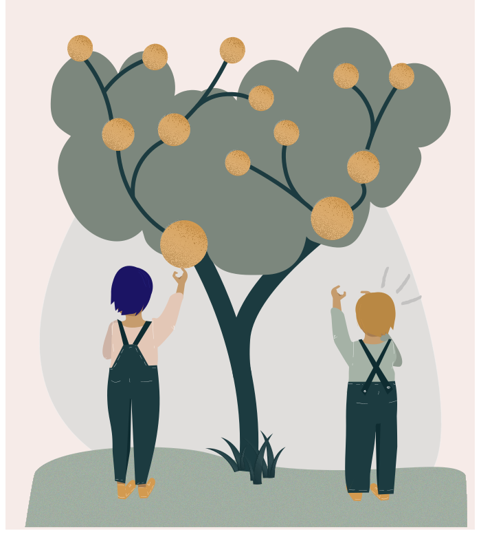
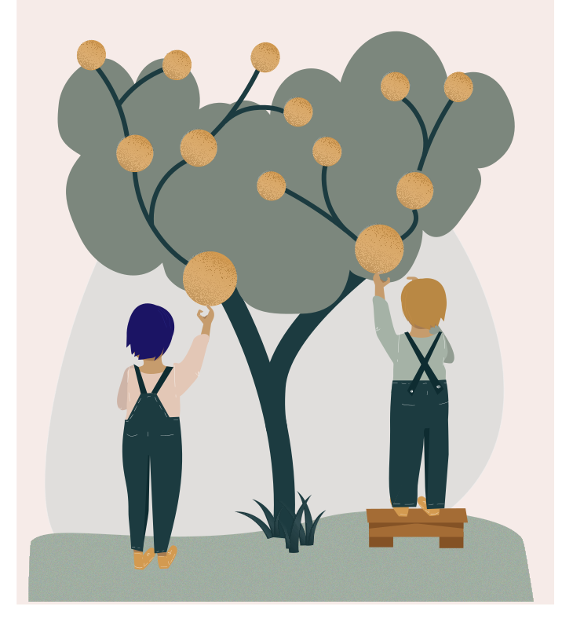

<hero-icon heroIcon='chap6'/>

<styled-text>

Filosofit ovat ehdottaneet oikeudenmukaisuuden käsitteelle useita erilaisia määritelmiä. Aristoteleen mukaan samanlaisia on kohdeltava samalla tavalla ja erilaisia eri tavalla.

Tässä lähtötilanteen tasa-arvon periaatteessa todetaan, että yksilöitä on kohdeltava samalla tavalla, elleivät he eroa toisistaan tavalla, joka on merkityksellinen heidän tilanteensa kannalta.

Jos esimerkiksi Alan Turing ja Ada Lovelace saivat molemmat samat arvosanat kokeista eikä heidän tai heidän suorittamiensa kokeiden välillä ole olennaisia eroja, heille olisi annettava sama arvosana. Jos Turing saisi paremman arvosanan kuin Lovelace vain paremman sosioekonomisen asemansa vuoksi, se olisi epäoikeudenmukaista. Miksi? Koska sosioekonomisella asemalla ei pitäisi olla merkitystä arvosanoja annettaessa.

Lähtötilanteen tasa-arvon periaatetta on kuitenkin arvosteltu ”sokeaksi”. Siinä ei oteta huomioon sitä, ettemme kaikki lähde samasta asemasta tai että on olemassa yksilöllisiä eroja, joilla on merkitystä. Toisin kuin lähtötilanteen tasa-arvo, ”lopputuloksen tasa-arvo” ei edistä oikeudenmukaisuutta kohtelemalla kategorisesti kaikkia samalla tavalla, vaan antamalla kaikille yhtäläiset mahdollisuudet hyödyntää samoja tilaisuuksia menestyä. On esimerkiksi tilanteita, joissa sosioekonomisen taustan erot ovat relevantti kriteeri ihmisten erilaiselle kohtelulle. Useimmat ihmiset esimerkiksi hyväksyvät sen oikeudenmukaisena, että valtio antaa sosiaalietuuksia vain niille kansalaisille, jotka todella tarvitsevat niitä, eikä tarjoa etuuksia kaikille.

**Lähtötilanteen tasa-arvo** (englanniksi equality) tarkoittaa, että kaikkia kohdellaan samalla tavalla.

**Lopputuloksen tasa-arvo** (englanniksi equity) tarkoittaa, että kaikki saavat sen, mitä he tarvitsevat menestyäkseen.

Toisaalta on myös kriteerejä, jotka eivät ole perusteltuja syitä kohdella ihmisiä eri tavalla. Olemme esimerkiksi yleisesti sitä mieltä, että ihmisen ikään, sukupuoleen, rotuun tai uskonnolliseen vakaumukseen perustuva erityiskohtelu on epäoikeudenmukaista. Mitä syrjintä siis on?

</styled-text>

<text-box variant='hint' name='Oikeudenmukaisuudet lajit'>

**Distributiivinen oikeudenmukaisuus** (jako-oikeudenmukaisuus) tarkoittaa sitä, missä määrin yhteiskunnan instituutiot varmistavat, että edut ja rasitteet jaetaan yhteiskunnan jäsenten kesken oikeudenmukaisella tavalla.

**Retributiivinen oikeudenmukaisuus** (oikaiseva oikeudenmukaisuus) tarkoittaa sitä, missä määrin rangaistukset ovat oikeudenmukaisia. Yleensä rangaistuksia pidetään oikeudenmukaisina siinä määrin kuin niissä otetaan huomioon asiaankuuluvat kriteerit, kuten rikoksen vakavuus ja rikollisen tarkoitus, ja jätetään huomiotta merkityksettömät kriteerit, kuten rotu.

**Vastavuoroinen oikeudenmukaisuus** tarkoittaa sitä, missä määrin ihmiset saavat oikeudenmukaisen korvauksen vammoistaan niiltä, jotka ovat vahingoittaneet heitä. Oikeudenmukainen korvaus on oikeassa suhteessa henkilölle aiheutuneeseen menetykseen. Juuri tällaisesta oikeudenmukaisuudesta on kyse keskusteluissa, jotka koskevat työntekijöiden terveydelle hiilikaivoksissa aiheutuneita vahinkoja. Toisten mukaan kaivosten omistajien pitäisi maksaa korvausta työntekijöille, jotka ovat työnsä vuoksi menettäneet terveytensä. Toisten mukaan työntekijät ottivat tämän riskin vapaaehtoisesti valitessaan työkseen työskentelyn kaivoksissa.

</text-box>
