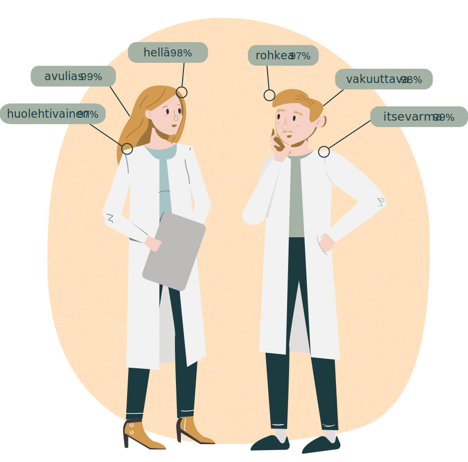

<hero-icon heroIcon='chap6'/>

<styled-text>

Tässä osassa käsittelemme syrjintää ja sitä, miten syrjivät käytännöt voivat ilmetä tekoälyn yhteydessä. Vinoumista on viime aikoina tullut tekoälyn etiikalle tyypillinen kysymys, koska toivo siitä, että algoritmien tarkka muodollisuus tekisi niistä immuuneja vinoumille, on osoittautunut pahasti vääräksi. Ensin tarkastelemme algoritmijärjestelmiä koskevia kolmea esimerkkiä, joiden avulla voimme analysoida tekoälyn yhteydessä esiintyviä syrjintää ja vinoumia.

#### Esimerkki 1: Sanojen upotus ([Bolukbasi ym.](https://arxiv.org/abs/1607.06520))

Sanojen upotus on luonnollisen kielen käsittelyn sovelluksissa (tekoäly, joka ymmärtää kieltä, kuten suomea) käytettävä tietorakenteen muoto. Sanojen upotusta varten käydään läpi tekstejä ja havaitaan, mitkä sanat esiintyvät usein yhdessä. Havaitut yhteenliittymät toimivat eräänlaisena tekoälyjärjestelmien sanakirjana, joka sisältää tietoa sanojen semanttisista suhteista, kuten siitä, että ”miehen” ja ”kuninkaan” suhde on samankaltainen kuin ”naisen” ja ”kuningattaren” suhde. Bolukbasi ym. havaitsivat, että tällaiset sana-assosiaatiot koodaavat usein käsitteellisiä suhteita, jotka ovat kulttuurisesti laajalle levinneitä mutta joita pidetään syrjivinä, mikä ei ollut kovinkaan yllättävää. Esimerkiksi ”äiti” yhdistetään ”sairaanhoitajaan” ja ”isä” taas ”lääkäriin”.

 </img>

#### Esimerkki 2: Amazonin rekrytointialgoritmi ([Dastin 2018](https://www.reuters.com/article/us-amazon-com-jobs-automation-insight/amazon-scraps-secret-ai-recruiting-tool-that-showed-bias-against-women-idUSKCN1MK08G))

Amazon alkoi vuonna 2014 kehittää sisäistä tekoälyjärjestelmää rekrytointiprosessinsa sujuvoittamiseksi. Mallin opetukseen käytettiin aiempien hakijoiden ansioluetteloita, minkä jälkeen järjestelmä analysoisi saapuvia ansioluetteloita ja arvioisi hakijat jatkoarviointia varten. Hyvin nopeasti kuitenkin havaittiin, että järjestelmä arvioi teknisten työpaikkojen hakijoita sukupuolen mukaan painottuneesti.

Järjestelmän todettiin hyljeksivän kaikkia ansioluetteloita, jotka osoittivat hakijan olevan nainen. Tällaisia osoituksia olivat esimerkiksi maininta naisten shakkikerhoon kuulumisesta tai naisten korkeakoulussa opiskelemisesta. Amazonin kerrotaan yrittäneen poistaa järjestelmän vinoumia, mutta yhtiö luopui lopulta koko hankkeesta. Järjestelmää ei koskaan käytetty varsinaisissa rekrytointiprosesseissa.

#### Esimerkki 3: Luottopisteytys ([Rutkenstein ja Velkova 2019](https://algorithmwatch.org/en/automating-society-2019/finland/))

Suomen yhdenvertaisuus- ja tasa-arvolautakunta arvioi vuonna 2018 tapausta, jossa kuluttajaluottohakemus hylättiin automaattisesti tilastollisin menetelmin. Luottolaitos Svea Ekonomi arvioi automaattisesti henkilön luottokelpoisuutta rakennusmateriaalien verkkokauppaoston yhteydessä tämän hakiessa luottoa ostoa varten. Luottopäätöksestä valitettiin. Lautakunta totesi, että hakijan ikä, miessukupuoli, suomi äidinkielenä ja asuinpaikka maaseudulla olivat kaikki tekijöitä, jotka aiheuttivat moniperusteista syrjintää, mikä johti päätökseen olla myöntämättä lainaa.

Tuomioistuin huomautti, että jos hakija olisi ollut nainen tai ruotsinkielinen, hänelle olisi myönnetty luotto. . . .

#### Mitä syrjintä on?

Ensinnäkin on tärkeää huomata, että sana ”diskriminoida” (englanniksi discriminate; ’erotella’, ’syrjiä’) vastinetta voidaan käyttää englannissa moraalisesti agnostisessa merkityksessä (”pystytkö erottamaan nämä kaksi väriä toisistaan?”). Tässä osassa tarkoitetaan sanan moraalisesti värittynyttä merkitystä ’syrjiä’. Mutta milloin syrjintä on moraalisesti arveluttavaa? Tämä voi tuntua typerältä kysymykseltä. Loppujen lopuksi useimmat ihmiset olisivat samaa mieltä siitä, että meillä on melko selkeä intuitiivinen käsitys siitä, mitä syrjintä on. Kuullessamme edellä olevan sanojen upotusta koskevan esimerkin, meillä ei ole minkäänlaisia vaikeuksia osoittaa loukkaavaa sana-assosiaatiota ja todeta ”Tämä on syrjivää!”. Sen pukeminen sanoiksi, mikä tekee siitä syrjivän, osoittautuu kuitenkin haasteelliseksi tehtäväksi. Aloitetaan kirjoittamalla ensin intuitiomme ja katsotaan, mihin jatkamme sen jälkeen.

</styled-text>

<text-box icon="exerIcon" name="Määritelmä 1: Syrjintä">

Syrjintä on yksilöiden erilaista kohtelua sen perusteella, mihin ryhmään he kuuluvat.

</text-box>

<styled-text>

Miten tämä määritelmä pärjää kuvatessaan käsitystämme syrjinnästä? Tässä keskeisimmät sanat ovat ”erilainen” ja ”ryhmä”. Syrjintä on siis jotakin vertailevaa, ja vertailtavat kohteet ovat erilaisia ryhmiä (tai pikemminkin ryhmittymiä) tai niihin kuuluvia henkilöitä. Tämä on hyvä alku, mutta analysoidaan ensin, mihin tämä määritelmä vetää rajan. Mitä otetaan mukaan, ja mitä jätetään pois?

Mieti esimerkiksi ajokortteja. Suomessa ajokortit myöntää poliisi tietyn käytännön harjoittelun ja teoreettisen koulutuksen sekä kokeen suorittamisen jälkeen. Näin ollen ajokortit myönnetään yksilön ansioiden perusteella. Pidämme kuitenkin yleisesti ottaen järkevänä sitä, että ihmisten, joiden näkökyky on vakavasti heikentynyt, ei ole mahdollista hankkia ajokorttia. Emme pidä tätä moraalisesti syrjivänä. Ajaminenhan olisi käytännössä joka tapauksessa mahdotonta heille. Siksi meidän on sisällytettävä määritelmään jonkinlainen käsitys syrjinnän haitallisuudesta.

Ajattele sitten kahvilaa, joka palvelee vain vihreisiin paitoihin pukeutuneita ihmisiä. Tämä on ehdottomasti ryhmän jäsenyyteen perustuvaa eriytettyä kohtelua, joka aiheuttaa jonkinlaista haittaa, mutta emme pitäisi moralistisessa mielessä myöskään tätä syrjintänä. Toimintatapa saattaisi tuntua meistä oudolta, mutta ei moraalisesti ongelmalliselta. Kiinnostavaa ei siis ole vain ryhmän jäsenyys, vaan myös se, mistä ryhmistä on kyse.

</styled-text>

<text-box name="Määritelmä 2: Syrjintä" icon="exerIcon">

Syrjintä on yhteiskunnallista haittaa aiheuttavaa eriytynyttä kohtelua, joka perustuu siihen, että henkilöä pidetään sosiaalisesti silmiinpistävän ryhmän jäsenenä. ([Lippert-Rasmussen 2014](https://oxford.universitypressscholarship.com/view/10.1093/acprof:oso/9780199796113.001.0001/acprof-9780199796113))

</text-box>

<styled-text>

”Sosiaalinen silmiinpistävyys” määrää, mitkä piirteet ovat moraalisesti merkityksellisiä syrjintätapauksissa. Mutta mitä se tarkoittaa? Lippert-Rasmussenin mukaan ominaisuus on sosiaalisesti silmiinpistävä, jos se on tärkeä sosiaalisten vuorovaikutusten rakenteelle useissa yhteyksissä. Toisin sanoen se, mitä pidetään sosiaalisesti silmiinpistävinä ryhminä, riippuu ajankohdasta: vaihtoehtoisella aikajanalla, jossa vihreän paidan käyttäminen olisi poikkeuksetta yhteiskunnallisesti tärkeä asia, joka vaikuttaisi henkilön arvoon, mahdollisuuksiin tai asemaan (jos vihreä paita olisi esimerkiksi uskonnollinen asu), edellä olevan kahvilaesimerkin tapausta voitaisiin hyvinkin pitää syrjintänä.

Moralistisen syrjinnän tunnistamisessa ei siis ole kyse pelkästään siitä, että tunnistetaan sattumanvaraisten ryhmien erilainen kohtelu. Pikemminkin tunnistaminen edellyttää erilaisen kohtelun asettamista sortamiseen ja arvostamiseen liittyvien yhteiskunnan käytäntöjen historian sekä niiden mukaisesti silmiinpistävinä pidettyjen ryhmittymien kontekstiin. Esimerkiksi Euroopan unionin perusoikeuskirjassa luetellaan seuraavat ominaisuudet, jotka ovat moraalisesti olennaisia syrjintätapauksissa: sukupuoli, rotu, ihonväri, etninen tai yhteiskunnallinen alkuperä, geneettiset ominaisuudet, kieli, uskonto tai vakaumus, poliittiset tai muut mielipiteet, kansalliseen vähemmistöön kuuluminen, varallisuus, syntyperä, vammaisuus, ikä ja sukupuolinen suuntautuminen.

### Haitat – mitä ne ovat?

Edellä esitetyissä kahdessa esimerkissä sosiaalista silmiinpistävyyttä koskeva ehto täyttyy selvästi molemmissa. Sukupuoli on luokka, joka on historiallisesti aina jäsentänyt sosiaalista vuorovaikutusta. Entä haitat? Toinen tapaus on toista selvempi: työpaikan menettäminen syistä, jotka eivät liity työhön soveltuvuuteen, on selvästi haitta. Sanojen upotusta koskevassa tapauksessa mahdollisia haittoja on vaikeampi määrittää. Ainakaan ei voida suoraan osoittaa menetettyä mahdollisuutta taikka evättyä palvelua tai etua. Tällaisissa tapauksissa syntyy kuitenkin haitan mahdollisuus. Tämän ottamiseksi huomioon on ymmärrettävä **allokatiivisten** ja **representationaalisten** haittojen välinen ero, kuten [Crawford (2017)](https://www.youtube.com/watch?v=fMym_BKWQzk) esittää.

#### Allokatiivinen haitta

Allokatiivisia haittoja syntyy tilanteissa, joissa yksilön tilanne huononee hänen käytettävissään olevien resurssien osalta. Tässä yhteydessä resurssit olisi ymmärrettävä laajasti paitsi ruokana, autoina, matkapuhelimina ja muina aineellisina tavaroina myös tarjottuina palveluina ja mahdollisuuksina. Samasta työstä maksettava matalampi palkka on ehdottomasti allokatiivinen haitta. Samoin on kuitenkin myös työhaastatteluun osallistumisen tai luoton epääminen sukupuolen perusteella.

Jopa riskin kaltaiset abstraktit seikat voivat olla allokatiivisten haittojen kohteita. [Wilson, Hoffman ja Morgenstern (2019)](http://arxiv.org/abs/1902.11097) havaitsivat, että hahmontunnistusalgoritmit tunnistavat huonommin tummasävyisiä hahmoja kuin vaaleasävyisiä hahmoja. Tutkijat Joy Buolamwini ja Timnit Gebru ovat myös osoittaneet, että kasvojentunnistusalgoritmit tunnistavat huomattavasti heikommin värillisten kuin valkoisten ihmisten kasvoja ([Buolamwini ja Gebru (2018)](http://proceedings.mlr.press/v81/buolamwini18a/buolamwini18a.pdf)). Tämä tarkoittaa, että automaattiautot saattavat osua todennäköisemmin mustaan kuin valkoiseen henkilöön. Koska on myönnettävä, että ruumiinvamman aiheuttaminen on selvä haitta, voidaan väittää, että haitta on aiheutunut jo ennen tällaisten onnettomuuksien tapahtumista. Riskien erilainen jakautuminen on nimittäin itsessään allokatiivinen haitta huonommassa asemassa olevalle osapuolelle.

#### Representationaalinen haitta

Representationaaliset haitat ovat haittoja, jotka eivät koske resurssien jakautumista, vaan pikemminkin ryhmien ja yksilöiden kuvaamista. Representationaalisia haittoja ovat esimerkiksi mustamaalaaminen, stereotypiointi, väärintunnistaminen ja eksnominaatio. Eksnominaatio on mediatutkimuksista peräisin oleva termi ja tarkoittaa käytäntöä, jossa tietystä luokasta tai tavasta olla tulee normi siten, että sitä ei nimetä tai määritellä omaksi luokakseen (esimerkiksi ”urheilija” versus ”naisurheilija”).

Representationaaliset haitat vaikuttavat yhteiskunnan kyseisistä ryhmistä luomiimme narratiiveihin. Vahvistamalla stereotyyppisiä näkemyksiä, heikentämällä yksilöiden yhteiskunnallista asemaa ja tekemällä tietyistä tavoista olla vallitsevan tilan representationaaliset haitat luovat perusteettomat perustelut epäoikeudenmukaisille käytännöille.

Representationaalisten haittojen käsitteen avulla pystymme tunnistamaan sukupuolittuneet sana-assosiaatiot syrjiviksi, vaikka sana-assosiaatiot itsessään eivät ole esimerkki resurssien jakautumisesta allokatiivisten haittojen merkityksessä.

### Miten vinoumia syntyy?

”Kaikki data on historiallista dataa: ajan ja paikan sekä poliittisen, taloudellisen, teknisen ja sosiaalisen ilmapiirin tuotetta. Jos et mieti, miksi datasi on olemassa ja muut tietoaineistot eivät ole olemassa, teet datatiedettä väärin.”

- [Melissa Terras (2019)](https://www.youtube.com/watch?v=4yYytLUViI4)

</styled-text>

<text-box name='Vinouman (englanniksi bias; ’systemaattinen virhe’) kolme eri merkitystä' icon="exerIcon">

**Tilastotieteessä** vinouma tarkoittaa otoksen tunnusluvun ja perusjoukon todellisen tunnusluvun välistä eroavuutta.

**Kognitiotieteessä** vinouma tarkoittaa päättelytapaa, joka todennäköisesti tuottaa virheellisen tai vääristyneen tuloksen.

**Sosiaalisen oikeudenmukaisuuden** yhteydessä vinouma tarkoittaa puolueellisuutta eli moraalisesti arveluttavaa eroa ihmisten kohtelussa.

</text-box>

<styled-text>

Tähän mennessä olemme onnistuneet löytämään järkevän määritelmän syrjinnälle, ja meillä on ainakin kaksi anekdoottista esimerkkiä tekoälyn osallistumisesta siihen. Molemmissa tapauksissa syrjivä käytäntö johtuu itse tekoälyjärjestelmässä olevista vinoumista. Jos haluamme saada käsityksen tästä asiasta, meidän on vielä löydettävä vastaukset seuraaviin kysymyksiin. Miten tekoälyjärjestelmistä tulee vinoutuneita? Miten voimme mitata, onko järjestelmä vinoutunut? Miten voimme korjata sen?

Tässä osassa tarkastelemme tapaa, jolla syrjivät käytännöt ylläpitävät toisiaan. Vinoutunut tekoäly on siis paitsi tekninen kysymys myös seurausta yhteiskunnallisten käytäntöjen historiasta. Pystymmekö havaitsemaan, milloin järjestelmämme vahvistavat näitä syrjiviä tapoja, ja etenkin, miten voimme pysäyttää syrjinnän kierteen? Seuraavaksi tarkastelemme kolmea tapaa, joilla vinoumat tulevat järjestelmään:

#### 1) Epäedustava otos

Selkein tapa, jolla vinoumat tulevat järjestelmään, on epäedustavan tietoaineiston välityksellä. Koneoppimisjärjestelmään syötettävä data ei siis anna oikeaa kuvaa koko maailmasta. Ei ole yllättävää, että manipuloimalla oppivan algoritmin tapaa nähdä maailma esimerkiksi voimistamalla joitakin ilmiöitä ja tukahduttamalla toisia järjestelmä oppii vääristyneen mallin.

Esimerkiksi monet kasvojentunnistusjärjestelmät eivät pysty tunnistamaan eri etnisiä ryhmiä yhtä hyvin. Tuloksena on, että esimerkiksi Googlen kuvien luokittelujärjestelmä on luokitellut mustat ihmiset gorilloiksi ([Kasperkevic 2015](https://www.theguardian.com/technology/2015/jul/01/google-sorry-racist-auto-tag-photo-app)).

Yksi syy tähän on [Buolamwinin ja Gebrun (2018)](http://proceedings.mlr.press/v81/buolamwini18a/buolamwini18a.pdf) mukaan se, että monissa suosituissa kasvotietoaineistoissa kuvien sukupuoli- ja etnisyysjakauma on erittäin kapea. Koneoppimisjärjestelmiin syötettyjen kasvojen antama kuva maailmassa esiintyvistä kasvoista on kiistatta valkoinen ja miespuolinen, eikä kuva edusta kasvojen todellista jakautumista maailmassa. Joskus tätä kutsutaan teknisesti otoskokoeroksi. Se johtaa vinoutuneisiin järjestelmiin, koska oppiva algoritmi jättää huonosti edustettuina olevat osapopulaatiot huomiotta saavuttaakseen suuremman ennustettavuuden suurimmassa osassa tietoaineistoa.

#### 2) Nimiöintiin liittyvät vinoumat

Annetaan datan puhua puolestaan, kuten sanonta kuuluu. Se on kaunis ajatus, mutta valitettava totuus on, ettei datalla ole omaa ääntä. Data puhuu vain tulkintojemme kautta – ja usein näitä tulkintoja on vaikea tehdä. Tämä pätee erityisesti tilanteisiin, joissa mitattavat asiat ja tutkittavat asiat ovat ristiriidassa keskenään.

Esimerkiksi rikosten ennustaminen on tehtävä, joka hyvin tehtynä kiinnostaisi niin tuomioistuimia, poliisia kuin kansalaisiakin. Valitettavasti rikollisuutta on vaikea mitata, ja siksi hyviä tietoaineistoja on vaikea tuottaa. Käytännössä voidaan mitata vain asioita, joista on tietoja saatavilla, kuten pidätyksiä ja tuomioita. Toiveena on, että nämä korvaavat indikaattorit korreloivat hyvin väestön rikollisuuden kanssa. Lisäksi olisi toivottavaa, että korvaavat indikaattorit korreloivat yhtä hyvin kaikkien väestön sosiaalisesti silmiinpistävien ryhmien osalta.

Valitettava totuus on, että pidätykset tuskin ovat rikollisuutta kuvaava puolueeton korvaava indikaattori. Pidätysten määrä saattaa antaa hyvän käsityksen väestön kokonaisrikollisuudesta, mutta määrän perusteella ei kannata tehdä eri ryhmiä koskevia yleistyksiä. Esimerkiksi Yhdysvalloissa mustat voidaan pidättää huumesyytteistä paljon todennäköisemmin kuin valkoiset ([Ferrer ja Connolly (2018)](https://www.ncbi.nlm.nih.gov/pmc/articles/PMC6050822/)). Tämä ei tarkoita, että mustat syyllistyisivät todennäköisemmin huumerikoksiin, vaan että mustat otetaan todennäköisemmin kiinni, pidätetään ja kirjataan huumerikosten vuoksi. Näin ollen kaikki rikollisuudesta tällaisen datan perusteella tehtävät päätelmät toistavat ja vahvistavat ilman muuta epäoikeudenmukaisuuksia, jotka saivat aikaan kyseisen datan.

#### 3) Kulttuuritietoisuuden puute

Vaikka ”tekoäly” ja ”koneoppiminen” luovat molemmat kuvaa koneiden autonomiasta, todellisuudessa tekoälyjärjestelmien toteuttamiseen tarvitaan suuri määrä ihmistyötä. Näin ollen oikeaa käsitystä tekoälyjärjestelmien käyttäytymisestä ei voida saada vain tarkastelemalla algoritmia ja käytettävää dataa. Tekoälyn käyttöönoton, tulkinnan, suunnittelun ja ylläpidon yhteydessä tehdään valintoja, ja toisinaan nämä valinnat voivat luoda järjestelmään vinoumia.

Selkeimpiä esimerkkejä tästä ovat tavat, joilla datasta tehdään ”puhdasta”. Tässä yhteydessä tehdään päätöksiä siitä, mikä on todellinen signaali eikä häiritsevää kohinaa. Tätä tehtävää pidetään joskus huoltotyönä, eikä siten osana tekoälyyn liittyvää ydinliiketoimintaa. Tätä työtä tehdään huomaamatta prosessin monissa vaiheissa. Esimerkiksi verkkolomakkeille kerättävän datan yhteydessä tätä kutsutaan syötteen puhdistamiseksi.

</styled-text>

<text-box name="" icon="techIcon">

Hyvä esimerkki edellä esitetystä on nimien kerääminen. Jotta järjestelmään ei pääsisi vääriä tietoja, tehdään tiettyjä rajoituksia sen osalta, miltä nimien pitäisi näyttää. Joskus oletetaan esimerkiksi, että nimet koostuvat etunimistä ja sukunimestä. Joskus oletetaan, että nimet sisältävät vain kirjaimia A:sta Ö:hön. Joskus taas oletetaan, että nimissä on aina enemmän kuin kaksi kirjainta.

Nämä saattavat olla järkeviä olettamuksia suunnittelijoiden ja ohjelmoijien rajallisessa kulttuurisessa kontekstissa, mutta todellisuudessa nimet ovat hyvin erilaisia. Nimiä ei oikeastaan voida kuvata yleisellä muodolla. Jos halutaan todella ottaa kaikenlaiset nimet huomioon, kaikkien verkkolomakkeiden nimikenttien tulisi olla tekstiruutuja, joiden merkkimäärää ei ole rajoitettu ja joihin voi kirjoittaa kaikenlaisia merkkejä. Ilman monipuolista kulttuurista ymmärrystä järjestelmä voidaan tahattomasti suunnitella siten, että ulkopuolelle jää suuria ihmisryhmiä, joiden nimet eivät ole vallitsevan kulttuurin normien mukaisia.

</text-box>

<styled-text>

Vinoumat voivat siis tulla järjestelmään monin eri tavoin. Edellä esitetään vain muutamia esimerkkejä asiaan liittyvistä mekanismeista. Tärkeää tässä on se, että analysoitaessa tekoälyjärjestelmien epäoikeudenmukaisuutta pelkkä algoritmien tarkastelu ei riitä. Epäoikeudenmukaisuus voi pikemminkin aiheutua historiallisista ja kulttuurisista syistä sekä suunnitteluun ja tiedon hallintaan tai käyttöönottoon liittyvistä syistä, joten on tarkasteltava koko tekoälyn kehittämisprosessia.

</styled-text>
