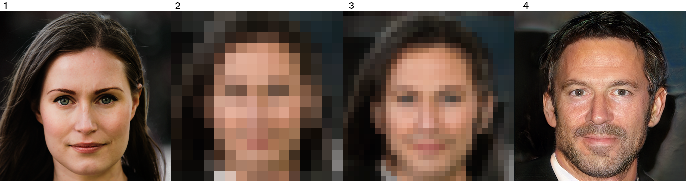

<hero-icon heroIcon='chap1'/>

<styled-text>

Historiskt har den tekniska utvecklingen kretsat kring olika teknikers funktion, användbarhet, effektivitet och tillförlitlighet. AI-teknik kräver dock en bredare diskussion om dess sociala acceptans. Den påverkar moraliska (och politiska) överväganden Den formar individer och samhällen och deras miljöer på ett sätt som får etiska konsekvenser.

Tolkningen av etiskt relevanta begrepp kan ändras i och med att nya tekniker dyker upp. Vad innebar till exempel begreppet ”integritet” innan vi hade sociala medier? När nya tekniker blir tillgängliga används de ofta för andra ändamål än vad de ursprungligen var avsedda för. Det innebär stora förändringar i det etiska landskapet och vi måste gång på gång reflektera över och analysera teknikens etiska grunder.

### Etiska ramverk

Etiska ramverk är försök att komma överens om värden och normer som kan användas av en grupp – det kan vara en grupp individer, medborgare, stater, företag i databranschen eller andra intressenter.

Ett flertal organisationer har deltagit i utvecklandet av ett etiskt ramverk för AI. De har givetvis olika åsikter men de har lyckats bygga upp en allmän konsensus. Enligt en färsk studie (Jobin o.a., 2019) har AI-etik förhållandevis snabbt styrts in mot fem principer:

* icke-skadlighet
* ansvar
* transparens och förklarbarhet
* rättvisa
* respekt för mänskliga rättigheter som integritet och säkerhet.

 </img>

De fem principerna för AI-etik svarar på olika frågor och fokuserar på olika värden:

1. Ska vi använda AI med goda avsikter och inte för att åsamka skada? (principen för välgörenhet/icke-skadlighet)
2. Vem bär skulden när AI åsamkar skada? (ansvarsprincipen)
3. Måste vi förstå vad AI gör och varför? (transparensprincipen)
4. Ska AI vara rättvis och icke-diskriminerande? (rättviseprincipen)
5. Ska AI respektera och främja mänskliga rättigheter? (principen om respekt för mänskliga rättigheter)

</styled-text>

<styled-text>

Resten av den här kursen kommer att fokusera på dessa principer för AI-etik. Vi kommer att analysera vad dessa begrepp innebär och hur de kan tolkas. I den traditionella filosofin talar man om detta som begreppsanalys. Vi kommer också titta på hur dessa begrepp används i praktiken, diskutera problem som de kan medföra samt nämna några öppna frågor om dessa principer.

I kursens avslutande avsnitt tittar vi på AI-etikprojektet i sin helhet. Vi ställer oss frågan om vem som ska få nytta av AI-etiken och vem eller vad som inte får det.

Slutligen vill vi nämna att AI-etiken står högst upp på listan när vi talar om AI och dess konsekvenser för samhället. Men det finns även andra teoretiska ramar för att titta på etiska koder för algoritmbaserade datadrivna system. Frågor om samhällskonsekvenserna av artificiell intelligens dyker upp inom fält som algoritmiska kulturer, genusstudier och mediastudier bland många andra. På motsvarande sätt formar de kognitiva och psykologiska aspekterna av interaktionen mellan människa och maskin frågan om vad som är ett lämpligt etiskt ramverk för AI. AI-etik handlar med andra ord om så mycket mer än bara data- och algoritmrelaterad etik.

</styled-text>

<quiz id="7bd8e959-d605-5a81-85fa-647d24c6f6a3">

Föreställ dig att du hamnar i en hetsig konversation på Twitter. Den börjar med en universitetsprofessors (@TuringLives) tweet om en bildomvandlingsmodell. Modellen avpixlar en pixlad bild på Finlands premiärminister Sanna Marin till en bild som föreställer en vit medelålders man:

 

Anm.: Det här är inte ett verkligt fall av AI-baserad fotoframställning.  
Bild 1: CC BY 4.0 Laura Kotila / Finlands premiärministers kansli (redigerad utifrån originalet) 
Bild 2 och 3 är konstnärliga avbildningar. 
Bild 4: CC BY-NC 4.0 NVIDIA Corporation 

**Vad är en bildomvandlingsalgoritm?**

Många av de mest kända exemplen på bildomvandling har gjorts med ett generativt adversariellt nätvek (GAN). Ett GAN är ett slags neural nätverksarkitektur som används för att ta fram generativa modeller.

Med GAN tävlar två nätverk mot varandra. Ett av nätverken är tränat till exempel för att generera bilder som de som finns i träningsdatauppsättningen (katter, ansikten eller dylikt). Det andra nätverket (det s.k. adversariella nätverket) har till uppgift att skilja bilder som skapats av det första nätverket från ursprungsbilderna i träningsdatauppsättningen.

Systemet tränar de två modellerna sida vid sida. I den inledande fasen av träningen är det den adversariella modellens uppgift att skilja de verkliga bilderna från de klumpiga försök till bilder som skapats av den generativa modellen. Men eftersom det generativa nätverket sakta men säkert blir bättre och bättre måste även den adversariella modellen förbättras. Cykeln pågår tills det nästan inte går att se någon skillnad mellan de genererade bilderna och de verkliga. (Mer information om GAN hittar du i onlinekursen om AI-element.)

GAN försöker inte bara återskapa objekten i träningsdatauppsättningen. Systemet tränas snarare för att kunna generera nya, verklighetstrogna objekt såsom bilder. GAN-nätverk producerar liksom många andra moderna algoritmer resultat som speglar de statistiska mönstren i indata.

De här bilderna framställdes i ett forskningsprojekt av Tero Karras, Samuli Laine, Timo Aila och Jaakko Lehtinen på NVIDIA Research i Helsingfors (mer information hittar du i [den här artikeln](https://research.aalto.fi/en/publications/progressive-growing-of-gans-for-improved-quality-stability-and-va)).

 

 

GAN-nätverk kan användas för många olika ändamål, som omvandlingar från bild till bild, till exempel för att göra om natt till dag eller för att generera realistiska bilder av objekt, scener eller människor.

Om du vill se hur GAN-nätverk fungerar kan du gå till: http://gandissect.res.ibm.com/ganpaint.html Utforska verktyget.

Nästa steg är att ge dig in i Twitter-diskussionen. Din uppgift är att svara på dessa tweetar genom att formulera din egen syn på den här frågan.

 

 

> @TuringLives: ”Moderna system för ’ansiktsuppsampling’ gör just detta. Om vi tränar algoritmer med bilder på vita män kommer algoritmerna att skapa bilder av vita män. Det är så de fungerar.”

> @AdaLovelace: ”Det här är ett exempel på något viktigare: De dolda farorna med våra algoritmer. Den dolda partiskheten i våra algoritmer. Skulle du vilja att algoritmer som dessa bestämde vem som får ett jobb, blir anhållen eller får komma igenom säkerhetskontrollen på flygplatsen? Det skulle inte jag.”

> @TuringLives: ”Det är så de här systemen fungerar. Algoritmerna ger partiska resultat om de tränas med partiska data. Ansiktsuppsamplingssystem får alla att se ut som vita män om de tränas med datauppsättningar som består av vita män.”

> @EugeneG: ”Men det är inte det som är problemet. Det handlar inte bara om datauppsättningar, det är hela maskininlärningsbranschen. Försök inte att förminska de skador som den här branschen orsakar genom att skylla på partiska data.”

> @TuringLives: ”Det gjorde jag inte heller. Jag sade bara att vi får partiska resultat om vi använder partiska data. Det är därför forskare måste vara mer försiktiga när de väljer ut sina data, så att de inte av misstag får in sådana här partiskheter. Och det är en sak att forska och en annan att tillämpa dessa metoder i verkligheten. Det är i de praktiska tillämpningarna som vi måste vara vaksamma på partiskhet, inte i den akademiska forskningen.”

> @Gödel´sGhost: ”Användarna får sina tillämpningar från ingenjörerna, och ingenjörerna får sina från datavetarna. Datavetare bör åtminstone vara medvetna om hur partiska deras metoder är. Och de bör informera om det.”

> @TuringLives: ”Jag håller med. Men visst är det något annat att forska om dessa saker än att använda dem i praktiken? Konsekvenserna av partiskhet är mer problematiska i en driftsatt produkt än i en akademisk avhandling. Du anklagar fel person.”

> @TheManIntheChineseRoom: ”Menar du alltså att forskare då de upptäcker att deras data är partiska kan använda dem ändå eftersom de har tillgång till dem och sedan säga att ’de är godtagbara eftersom det bara rör sig om ett akademiskt experiment och jag kan inte ansvara för om någon använder dem på ett skadligt sätt?’ Är det ditt svar?”

> @TuringLives: ”Svaret på det är nog både ja och nej. Håller du med om att det är skillnad på grundforskning och tillämpningar i verkligheten? Tänk på fysiker. Är de ansvariga för kärnvapenutvecklingen? Eller ansvarar biologer som studerar genetik för eugeniska tillämpningar? Är det inte precis samma fråga? Kan vi döma grundforskningen eftersom den kan komma att få negativa tillämpningar? Observera att jag håller med om att partiskhet är ett stort problem, men det gäller tillämpningar i verkligheten.”

Hur skulle du svara? Skapa ditt eget Twitter-namn och skriv ditt svar nedan.

</quiz>

<quiz id="985b2f5d-1c66-5611-a636-288e980a6650"> </quiz>

<quiz id="6309087b-9352-5607-98bd-16d8324784be"> </quiz>
