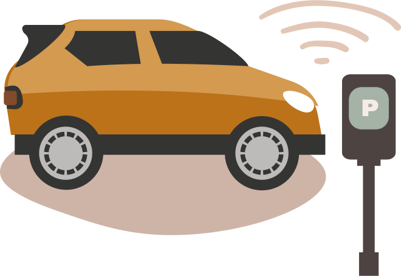

<hero-icon heroIcon='chap3'/>

<text-box name="" icon="techIcon">

I Amsterdam sker parkeringskontrollen delvis automatiskt för de cirka 150 000 parkeringsplatserna på stadens gator. Tjänsten följer en trestegsprocess:

1) Bilar utrustade med kameror kör runt i staden och använder programvara för objektigenkänning för att läsa av och identifiera registreringsskyltarna på bilarna i omgivningen.

2) När en registreringsskylt har identifierats kontrolleras numret mot det nationella parkeringsregistret för att se om bilen har tillstånd att parkera på platsen i fråga. Om ingen betalning har gjorts för parkeringen skickas fallet vidare till en mänsklig kontrollant för vidare bearbetning.

3) En parkeringskontrollant använder avläsningsbilderna för att på distans avgöra om det föreligger några särskilda omständigheter, som till exempel av- och pålastning, eller om det rör sig om en stillastående bil vid ett trafikljus. Parkeringskontrollanten kan även välja att kontrollera situationen på plats. Om det inte finns någon giltig orsak till den obetalda parkeringen utfärdas en parkeringsbot.

 

 

  </img>

</text-box>

<styled-text>

Parkeringskontrolltjänsten är ett exempel på hur algoritmer används alltmer för att automatisera offentliga tjänster. Eftersom algoritmer är exakta, snabba och noggranna ger de ofta förbättrad effektivitet, tillförlitlighet och konsekvens. Paradoxalt nog kan algoritmer även leda till systemfel, vara partiska och orsaka allvarlig skada. Till exempel kan det vara fel på ett avläsningssystem. Det kan göra misstag och föreslå parkeringsböter på ogiltig grund. Vem ska ta ansvaret när något sådant händer, och varför?

Även om vi säger saker som ”ja, det var algoritmens fel och det är den som bär ansvaret för att fel beslut togs”, menar vi inte bokstavligen att moderna algoritmer är moraliskt skyldiga. Det är snarare så att algoritmerna är kausala faktorer som ligger till grund för besluten. Orsaker är dock något annat än moraliskt ansvar.

Även om algoritmerna inte i sig själva kan hållas ansvariga – eftersom de inte är agenter i moralisk eller rättslig mening – så kan de organisationer som utformar och använder algoritmerna genom styrningsstrukturer ses som moraliskt ansvariga. I exemplet från Amsterdam är det den mänskliga parkeringskontrollanten som tar det slutliga beslutet, och det är därmed hen som är ansvarig. Det kan dock hända att även den mänskliga kontrollanten så småningom ersätts av algoritmer. Vem blir då ansvarig?

</styled-text>

<text-box icon="techIcon" name="Automatiserat eller autonomt beslutsfattande">

**Automatiserade system** körs vanligtvis inom en väl avvägd uppsättning av parametrar, och det finns stora begränsningar för vad de kan göra. De beslut som fattas och åtgärder som vidtas av ett automatiserat system är baserade på i förväg definierad heuristik eller regler.

**Autonoma system** lär sig och anpassar sig till dynamiska miljöer och utvecklas med den omgivande miljön. De data det lär sig och anpassar sig efter kan vara andra än de som fanns i åtanke när systemet implementerades.

Automatisering och autonomisering är gradvisa och rör sig på en skala snarare än att svara på enkla ja-eller-nej-frågor. Ett system kan till exempel sägas vara autonomt och till en viss grad fritt från mänsklig kontroll.

 
 
 

</text-box>
