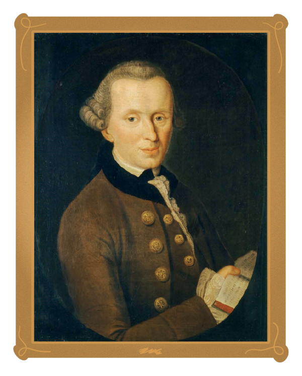

<hero-icon heroIcon='chap3'/>

<styled-text>

Inom etiken är frågan om ansvar nära besläktad med begreppet ”moralisk agens”. En moralisk agent är ”en agent som kan handla efter vad som är rätt och fel”. Det är viktigt att ha i åtanke att endast moraliska agenter kan vara moraliskt ansvariga för sina handlingar.

**Handling och försummelse**

Filosofiskt sett ansvarar en moralisk agent främst för sina egna handlingar. Ibland är agenter även ansvariga för icke-handlingar, eller försummelser. Om jag dödar någon är jag med andra ord ansvarig för den handlingen. Om jag bara låter någon dö är jag ansvarig för att inte hjälpa (försumma att hjälpa), trots att jag inte aktivt har dödat någon.

Försummelser och handlingar är inte moraliskt likvärdiga. Det är moraliskt sett mindre dåligt att försumma något än att utföra en handling. Det är värre att döda någon än att låta någon dö. Det innebär dock inte att det är moraliskt rätt att försumma. Vi kan dock inte ansvara för allt vi inte gör. Däremot är vi ansvariga för de saker som vi med avsikt och vetskap väljer att göra eller inte göra.

**Autonomi**

Filosofiskt sett kräver det moraliska ansvaret 1) moralisk autonomi och 2) möjligheten att utvärdera konsekvenserna av handlingar. Med ”moralisk autonomi” avses agentens kapacitet att underställa sig själv den moraliska koden. Dessutom kräver autonomin följande:

* kapaciteten att bestämma över sig själv utan manipulation från andra och möjligheten att handla utan yttre eller inre begränsningar
* att de begär (värden, känslor osv.) som får någon att handla är autentiska
* tillräcklig kognitiv förmåga – dvs. att en agent måste kunna utvärdera, förutsäga och jämföra konsekvenserna av sina handlingar, samt att med hjälp av etiskt betydelsefulla kriterier uppskatta vilka motiv en viss handling har.

</styled-text>

<text-box icon="philIcon" name="Moraliskt ansvar">

Immanuel Kant är en Europas mest omtalade moralfilosofer. För Immanuel Kant förutsätter det praktiska förnuftet – vår möjlighet att använda vårt förnuft för att välja våra handlingar – att vi är fria. Handlingar baseras på vår egen vilja att använda moralisk lag till vägledning för våra beslut. Kant, och kantianerna, hävdar att denna förmåga (att underställa oss själva moralisk lag) är ursprungskällan till allt moraliskt värde.

Enligt Kant är vi skyldiga oss själva moralisk respekt för vår autonomi. Men vi är också skyldiga alla andra samma respekt för deras förmåga. Därför måste vi (enligt den andra formuleringen i Kants så omtalade kategoriska imperativ) handla med djup respekt för andra människors autonomi. Det gör att autonomin fungerar både som en modell för det praktiska förnuftet i bedömningen av moralisk förpliktelse och som en egenskap hos andra människor som förtjänar vår moraliska respekt. (Detta diskuteras vidare i [Immanuel Kant och moralfilosofin](https://en.wikipedia.org/wiki/Categorical_imperative).)

 </img>

</text-box>

<quiz id="859f5ee1-7ad9-56f7-ac4d-96be4353ba03"> </quiz>
