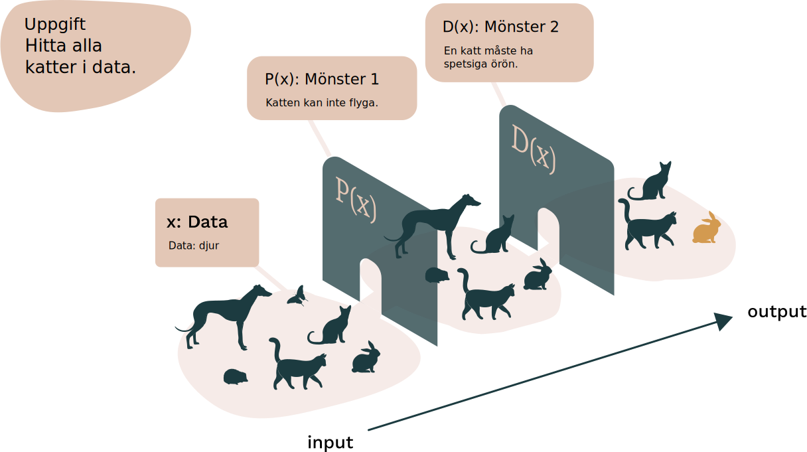
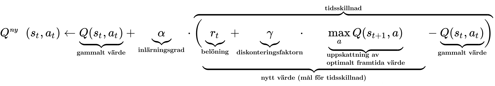
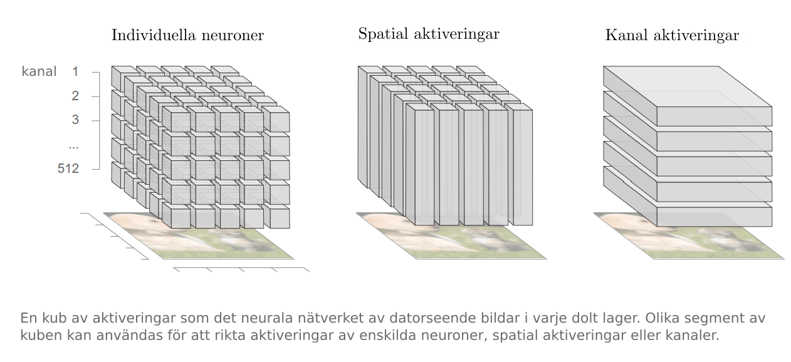
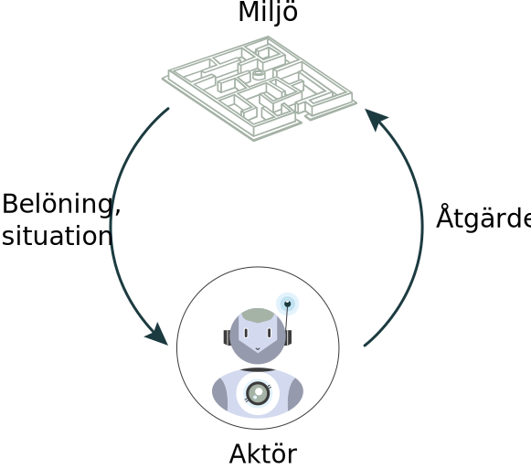
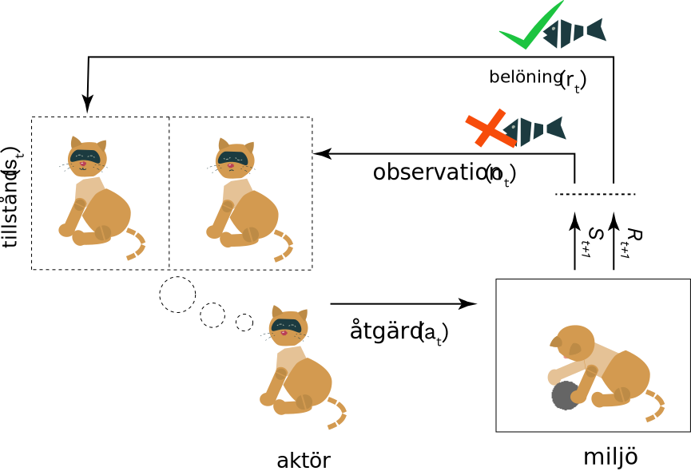

<hero-icon heroIcon='chap4'/>

<styled-text>

Transparens kan definieras på många olika sätt. Det finns ett antal besläktade begrepp som ibland används synonymt med transparens, däribland ”förklarbarhet” (AI-forskning på detta område kallas XAI), ”tolkningsbarhet”, ”förståelighet” och ”svart låda”.

Transparens är i princip en applikationsegenskap. Det handlar om hur väl det går att förstå ett systems inre funktioner ”i teorin”. Det kan även syfta på sättet att ge förklaringar för algoritmbaserade modeller och beslut som användaren kan förstå. Det har att göra med den allmänna uppfattningen av och förståelsen för hur AI fungerar. Transparens kan även ses som ett lite vidare begrepp i form av ett sociotekniskt och normativt öppenhetsideal.

Det finns många öppna frågor om vad transparens eller förklarbarhet är, och hur hög nivå av transparens som krävs för olika intressenter. Betydelsen av ”transparens” kan variera beroende på varje specifik situation. Det är en vetenskapligt obesvarad fråga huruvida det finns flera olika typer av transparens. Dessutom kan transparens syfta på en sak om avsikten är att analysera den juridiska betydelsen av opartiskhet, och något annat om den är att diskutera samma sak i termer av funktioner i maskininlärningssystem.

### Transparens som systemegenskap

Som systemegenskap handlar transparens om hur en modell fungerar internt. Transparens kan vidare delas in i ”simulerbarhet” (en förståelse för hur modellen fungerar), ”nedbrytbarhet” (förståelse av de individuella komponenterna) samt algoritmtransparens (algoritmers synlighet).

</styled-text>

<text-box name="Vad gör ett system till en ”svart låda”?" icon="chap4">

**Komplexitet.** I moderna AI-system är driften av neurala nätverk kodad i tusentals, eller till och med miljontals, numeriska koefficienter. Vanligtvis lär sig systemet sina värden i träningsfasen. Eftersom driften av det neurala nätverket beror på de komplexa interaktionerna mellan dessa värden är det praktiskt taget omöjligt att förstå hur nätverket fungerar, även om alla parametrar är kända.

**Svårighet att utveckla förklarbara lösningar.** Även om de AI-modeller som används har ett visst stöd för förklarbarhet krävs ytterligare utveckling för att bygga in förklarbarheten i systemet. Det kan vara svårt att skapa en användarupplevelse som ger detaljerade men ändå begripliga förklaringar för användarna.

**Riskmoment.** Många AI-algoritmer kan luras om en angripare noggrant designar en inmatning som orsakar ett fel i systemet. I ett mycket transparent system kan det vara lättare ett få systemet att ge konstiga eller oönskade resultat. Därför utformas system ibland avsiktligen som svarta lådor.

</text-box>

<styled-text>

Eftersom många av dagens mest effektiva djupinlärningsmodeller är svarta lådor (nästan per definition) verkar det som att forskare tar för givet att vi inte kommer kunna utveckla dem som helt transparenta. Det gör att samtalet snarare är inriktat på att hitta en ”tillräcklig nivå av transparens”. Skulle det räcka om algoritmerna gav oss information om hur de kommit fram till sina beslut och förklarade vilken som är den minsta ändring ”som krävs för att få det önskade resultatet” ([Wachter o.a., 2018](https://arxiv.org/pdf/1811.01439.pdf))? Om en algoritm till exempel nekar någon socialbidrag kunde den informera personen om orsaken till nekandet och förklara vad personen behöver göra för att få ett positivt beslut.

Förklaringen kan till exempel innehålla information om vilken som är maxlönen för att man ska kunna få bidrag (indata), samt hur ett minskat belopp skulle påverka fattade beslut (manipulation av indata). Problemet är dock att rätten att veta även gäller i situationer då systemet begår misstag. Då kan det vara på plats att utföra en kritisk analys på algoritmen och identifiera de faktorer som orsakar misstagen (Rusanen och Ylikoski, 2017). Detta kan inte åstadkommas endast genom manipulation av in- och utdata.

 </img>

I den här bilden visas en mycket förenklad AI-modell som har till uppgift att identifiera alla katter i en datauppsättning som innehåller alla slags djur. Modellen har slutit sig till två mönster för att definiera en katt. För modellen är de bara siffror, men för oss ser de ut som beskrivbara mönster. De mönster och egenskaper som slutleds kan dock se ganska komplicerade ut i våra ögon. Mer information finns på https://distill.pub/2017/feature-visualization/.

Dessutom fyller transparens många fler funktioner i moderna samtal om maskininlärningsmodeller. Den kan vara relevant för utvecklingen av lagstiftning eller för att skapa förtroende för AI hos allmänheten. För att omfatta dessa frågor brukar begreppet transparens inom AI ges en vidare definition i termer av ”förståelighet”.

### Transparens som förståelighet

Förståeligheten – eller begripligheten – för en algoritm kräver att man kan förklara hur ett beslut fattades av en AI-modell på ett sätt som är tillräckligt begripligt för dem som påverkas av modellen. Vi bör få en konkret känsla av hur eller varför algoritmen genom indata kommit fram till ett visst beslut.

Det är dock allmänt besvärligt att översätta begrepp slutledda av algoritmer till begrepp som kan förstås av oss människor. I vissa länder har lagstiftarna diskuterat huruvida offentliga myndigheter ska publicera de algoritmer de använder i automatiserat beslutsfattande i form av programmeringskod. De flesta av oss förstår dock inte programmeringskod. Därför är det svårt att förstå på vilket sätt transparensen ökar med publiceringen av kod.

```sas
* Take seed number from machine time for sample;
data _NULL_;
 seedNumber= int(%sysfunc(TIME())) ;
 call symput('seedNumber',seedNumber);
run;
%put &seedNumber;

* Order universe ;
proc sort data=universe;
 by henro;
run;
* Make a sample, n=2000 ;
proc surveyselect data=universe method=srs
     n=2000 seed=&seedNumber
     out=sample;
run;
* Order sample ;
proc sort data=sample;
 by henro;
run;

 * Unite sample to universe, create variable TYPE; data all;
 merge universe(in=a)
       sample(in=b);
 by henro;
 length TYPE $ 1.;
 if a then TYPE='V'; * referenceGroup ;
 if b then TYPE='K'; * experimentGroup ;

 * assign values to variable REAOH ;
REAOH='PUOTOS';
run;

* Confirm that all 2000 people have a TYPE that is given a value 'K';
proc freq;
 tables type;
run;
```


Skulle det vara till större hjälp om de exakta algoritmerna publicerades? I de flesta fall ökas inte transparensen heller av att de exakta algoritmerna publiceras, framför allt inte om du inte har tillgång till de data som användes i en modell.



Idag utvecklar kognitions- och datavetare människovänliga beskrivningar av hur och varför tillämpningar fungerar. Det handlar bland annat om utvecklingen av datavisualiseringsverktyg, interaktiva gränssnitt, verbala förklaringar eller beskrivningar på metanivå av modellens egenskaper. Dessa verktyg kan vara mycket användbara för att göra AI-tillämpningar mer tillgängliga. Det är dock fortfarande mycket som behöver göras.




Diagram CC-BY 4.0 Olah, et al., "The Building Blocks of Interpretability", Distill, 2018.

<br>
<br>

Det faktum att förståeligheten även beror på personliga och kulturella komponenter försvårar detta ytterligare. Logiken för hur visualiseringar tolkas – eller hur slutsatser dras från dem – skiljer sig mellan olika kulturer. Teknikutvecklare måste därför se till att det visuella språk de använder är tillräckligt lätt att förstå.

Mycket beror också på graden av förståelse för data eller algoritmer, till exempel kunskap om modern teknik. I vissa kulturer används en mer välbekant vokabulär för modern teknik, medan det i många andra kan röra sig om helt nya begrepp. För att öka förståelsen krävs helt klart betydande utbildningssatsningar för att förbättra den algoritmrelaterade kompetensen – till exempel vad gäller ”datalogiskt tänkande” ([Heintz o.a., 2016](https://ieeexplore.ieee.org/document/7757410)). Användarnas kunskaper har en direkt effekt på transparensen när det kommer till grundläggande förståelse av AI-system. Det kan vara det mest effektiva och praktiska sättet att göra lådorna mindre svarta för många användare.

</styled-text>


<text-box name="Hur görs modellerna mer transparenta?" icon="techIcon">

Problemet med den svarta lådan är ingen nyhet inom artificiell intelligens. Möjligheten att göra maskininlärningsmodeller transparenta är ett aktivt forskningsfält. I grova drag finns det fem huvudstrategier:

* **Använda enklare modeller**. Här offras dock ofta precisionen till förmån för förklarbarheten.

* **Kombinera enklare och mer avancerade modeller**. Medan de avancerade modellerna låter systemet göra mer komplexa beräkningar kan de enklare modellerna användas för att öka transparensen.

* **Ändra indata för att spåra relevanta beroenden mellan indata och utdata.**. Om en manipulering av indata ändrar de övergripande modellresultaten kan dessa indata spela en viktig roll i klassificeringen.

* **Utforma modellerna efter användaren**. Detta kräver kognitivt och psykologiskt effektiva metoder och verktyg för att visualisera modellstadier eller styra uppmärksamheten. I visuellt innehåll, till exempel, kan stadier i modellernas mellanliggande skikt visualiseras som delar (till exempel som huvud, armar och ben) för att på så sätt ge en begriplig beskrivning för bildklassificering. Forskare har även utvecklat metoder för att styra ”uppmärksamheten” mot de viktigaste delarna av indata. De kan visualiseras genom att markera de delar av en bild eller text som i störst utsträckning bidrar till en viss rekommendation.

* **Följa de senaste forskningsrönen**. Det forskas mycket inom de olika aspekterna av förklarlig AI – bland annat rörande sociokognitiva frågor – och nya tekniker är på väg att utvecklas.


</text-box>

<styled-text>

<quiz id="7b4815be-f1e3-572d-8bcc-80bb83262f1a">

Det finns ett behov att översätta algoritmiska begrepp till ett lättbegripligt språk. De flesta av oss som inte har en bakgrund inom datavetenskap känner inte till den grundläggande terminologin för AI. Det har en direkt inverkan på vår kapacitet att förstå den senaste utvecklingen.

<span style="font-size: 30px">1.</span>


<span style="font-size: 30px">2.</span>


<br>

<span style="font-size: 30px">3.</span>


<br>

Jämför följande tre visualiseringar av algoritmer för fortbildning. Vilken av dem är lättast att förstå? Motivera ditt svar.

<br>

</quiz>
