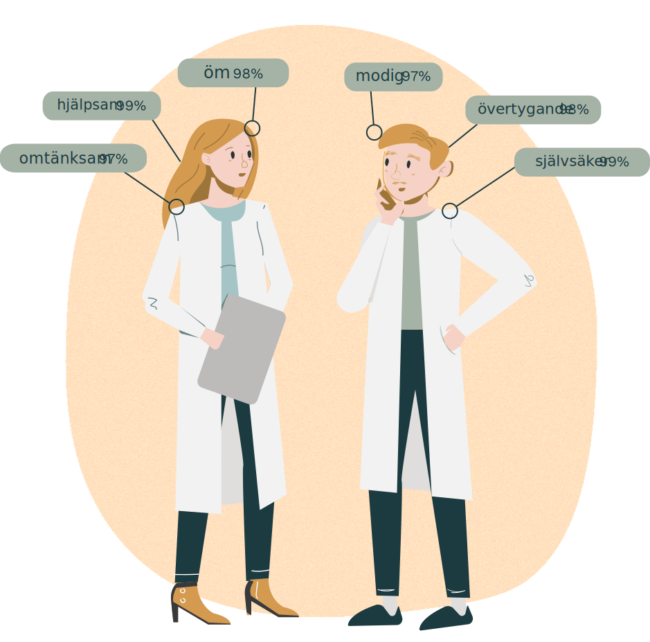

<hero-icon heroIcon='chap6'/>

<styled-text>

I det här avsnittet tittar vi på diskriminering och hur artificiell intelligens kan leda till diskriminerande behandling. Partiskhet har på sistone kommit att bli grundfrågan inom AI-etiken, eftersom förhoppningen att algoritmernas exakta formbundenhet gör dem immuna mot partiskhet har visat sig vara i högsta grad felaktig. Först tittar vi på tre exempel på algoritmbaserade system som ska hjälpa oss att analysera frågan om diskriminering och partiskhet inom AI.

#### Exempel 1: Ordinbäddning ([Bolukbasi o.a.](https://arxiv.org/abs/1607.06520)).

Ordinbäddning är ett slags datastruktur som används i tillämpningar för naturlig språkbehandling (AI som kan förstå ett språk, som till exempel engelska). De skapas genom att söka igenom texter och notera vilka ord som ofta förekommer tillsammans. De associationer som hittas fungerar som ett slags ordbok för AI-system som fångar upp semantiska släktskap av typen ”man” i förhållande till ”kung” eller ”kvinna” i förhållande till ”drottning”. Bolukbasi o.a. kom fram till att dessa ordassociationer ganska förväntat har en tendens att innehålla begreppsmässiga relationer som är kulturellt övertygande men som anses diskriminerande. Till exempel associeras ofta ”mamma” till ”sjuksköterska” och ”pappa” till ”läkare”.

 </img>

#### Exempel 2: Amazons rekryteringsalgoritm ([Dastin 2018](https://www.reuters.com/article/us-amazon-com-jobs-automation-insight/amazon-scraps-secret-ai-recruiting-tool-that-showed-bias-against-women-idUSKCN1MK08G))

År 2014 började Amazon utveckla ett internt AI-system som skulle effektivisera deras rekryteringsprocess. Med meritförteckningar från tidigare sökande som träningsdata skulle systemet analysera inkommande meritförteckningar och betygsätta de ansökande för vidare utvärdering. Det dröjde dock inte länge förrän systemet upptäcktes gradera ansökande till tekniska positioner på ett könsmässigt snedfördelat sätt.

Det upptäcktes att systemet gav lägre poäng för meritförteckningar från kvinnliga ansökande. Det kunde röra sig om kommentarer om deltagande i en schackklubb för kvinnor, eller en högskola endast för kvinnor. Amazon lär ha försökt korrigera systemet för att göra det mer opartiskt, men de valde till slut att i stället lägga ned hela projektet. Systemet kom aldrig att användas för faktiska rekryteringsprocesser.

#### Exempel 3: Kreditbedömning ([Rutkenstein och Velkova 2019](https://algorithmwatch.org/en/automating-society-2019/finland/))

##### Translation pending

In 2018, the non-discrimination and equality tribunal of Finland judged on a case where a consumer credit application was automatically denied using statistical methods. The credit institution Svea Ekonomi atuomatically evaluated an individual's creditworthiness in conjunction to his online purchase of building materials, for which he was seeking credit. The credit decision was appealed, and the the tribunal found that "the applicant’s age, male gender, Finnish as the mother tongue and the place of residence in a rural area were all factors that contributed to a case of multiple discriminations, resulting in a decision not to grant a loan." The tribunal remarked, that had the applicant been a woman, or Swedish speaking, he would have been granted the credit.

#### Vad är diskriminering?

De flesta människor håller nog med om att vi intuitivt ganska väl kan avgöra vad diskriminering innebär. I exemplet med ordinbäddning ovan kan vi lätt peka ut de stötande ordassociationerna och hävda att de är diskriminerande. Det kan dock visa sig vara mycket klurigare att sätta ord på vad det är som gör dem diskriminerande. Låt oss börja med att skriva ned vilken vår avsikt är så ser vi vad det leder till:

</styled-text>

<text-box icon="exerIcon" name="Definition 1: Diskriminering">

Diskriminering är när individer behandlas olika baserat på deras grupptillhörighet.

</text-box>

<styled-text>

Hur väl lyckas den här definitionen fånga vår känsla för vad diskriminering är? De viktiga orden här är ”olika” och ”grupp”. Diskriminering är alltså något jämförbart, och det som jämförs är olika grupper (eller snarare grupperingar) eller de individer som dessa grupper utgörs av. Det här är en bra början, men vi behöver ta reda på var den här definitionen drar gränsen. Vad inkluderas och vad lämnas utanför?

Ta till exempel körkort. I Finland utfärdas körkort av polisen efter att föraren har genomgått en viss mängd praktisk och teoretisk utbildning samt blivit godkänd på ett prov. Körkortet utfärdas således baserat på individuella meriter. Vi anser det i allmänhet rimligt att människor med gravt nedsatt syn är uteslutna från att delta i processen, utan att för den skull anse detta vara diskriminerande. Det skulle ju hur som helst ändå vara praktiskt taget omöjligt för personen med synnedsättning att köra. Vi behöver alltså inkludera en viss känsla för diskrimineringens skadlighet i definitionen.

Föreställ dig nu ett kafé som endast serverar kunder som bär grön tröja. Det här är utan tvekan särbehandling baserad på grupptillhörighet som bidrar till någon typ av skada, men vi skulle inte heller i det här fallet anse att det rör sig om diskriminering. Vi kanske tycker att regeln är konstig, men vi ser den inte som moraliskt tvivelaktig. Det handlar således inte om grupptillhörighet i allmänhet, utan om vissa specifika grupper.

</styled-text>

<text-box name="Definition 2: Diskriminering" icon="exerIcon">

Diskriminering är särbehandling baserad på uppfattad tillhörighet till en socialt iögonfallande grupp och som vållar social skada. ([Lippert-Rasmussen 2014](https://oxford.universitypressscholarship.com/view/10.1093/acprof:oso/9780199796113.001.0001/acprof-9780199796113))

</text-box>

<styled-text>

”Socialt iögonfallande” är vad som avgör vilka egenskaper som är moraliskt relevanta när det förekommer diskriminering. Men vad innebär det? Enligt Lippert-Rasmussen är en egenskap socialt iögonfallande om den är viktig för den sociala samspelsstrukturen i ett flertal sammanhang. Vad som anses vara socialt iögonfallande klassificeringar är således historiskt betingat: om vår historia hade varit en annan, där gröna tröjor var socialt viktiga och hade betydelse för en persons värde, möjligheter eller status (om det till exempel var ett religiöst plagg), skulle kaféexemplet ovan lätt ha kunnat anses vara ett fall av diskriminering.

Att identifiera diskriminering handlar alltså inte bara om att kunna se skillnader i behandling mellan olika godtyckliga grupperingar. Vi måste även kunna sätta särbehandlingen i ett historiskt sammanhang av förtryck och värderingar i samhället, så att grupperingarna blir iögonfallande. Till exempel listas i EU-stadgan om de grundläggande rättigheterna följande som egenskaper som moraliskt relevanta i diskriminerande situationer: ”kön, ras, hudfärg, etniskt eller socialt ursprung, genetiska särdrag, språk, religion eller övertygelse, politisk eller annan åskådning, tillhörighet till nationell minoritet, förmögenhet, börd, funktionshinder, ålder eller sexuell läggning”.

### Skada – vad är det?

I båda exemplen ovan är villkoret socialt iögonfallande helt klart uppfyllt. Kön är en kategori som alltid har strukturerat social interaktion. Men vållar situationerna någon skada? Ett av exemplen är mer uppenbart än det andra: att bli utesluten som kandidat till ett jobb av skäl som inte är relaterade till ens lämplighet för jobbet i fråga är helt klart en skada. I fallet med ordinbäddning är det dock svårare att avgöra om det leder till skada. Vi kan åtminstone inte peka direkt på en missad möjlighet eller en nekad vara eller tjänst. Fall som detta anstiftar dock till skada. För att fånga upp detta behöver vi förstå skillnaden mellan **allokeringsskada** och **representationsskada**, så som de beskrivs i [Crawford 2017](https://www.youtube.com/watch?v=fMym_BKWQzk).

#### Allokeringsskada

Allokeringsskador är situationer där individer gör en förlust inom ramen för de resurser de har tillgång till. Resurser ska här ges en bred tolkning och inte förstås enbart som mat, bilar, mobiltelefoner och andra materiella ting, utan även tjänster och möjligheter ingår i definitionen. Lägre lön för samma arbete är definitivt en allokeringsskada. Men det är även att neka någon möjligheten till en anställningsintervju baserat på kön, eller att neka en kredit av samma skäl.

Även mer abstrakta fenomen som risk kan visa tecken på allokeringsskada. [Wilson, Hoffman, och Morgenstern (2019)](http://arxiv.org/abs/1902.11097) upptäckte att objektdetekteringsalgoritmer är sämre på att upptäcka mörka figurer än ljusa. Forskarna Joy Buolamwini och Timnit Gebru har även kunnat visa att ansiktsigenkänningsalgoritmer är märkbart sämre på att känna igen mörkhyade personers ansikten ([Buolamwini och Gebru 2018](http://proceedings.mlr.press/v81/buolamwini18a/buolamwini18a.pdf)). Det innebär att förarlösa bilar kan löpa större risk att köra på en mörkhyad person än en ljushyad. Utöver den uppenbara kroppsskada som detta innebär, kan man nu även hävda att skada har vållats redan innan en sådan olycka inträffar. Den ojämna riskfördelningen är nämligen i sig själv en allokeringsskada för den drabbade parten.

#### Representationsskada

Representationsskador är sådana skador som inte berör fördelningen av egendom. De berör snarare representationen av grupper och individer. I den här klassen ingår skador som nedsättande behandling, stereotypisering, felbedömning och exnominering. Exnominering är en term som har sitt ursprung i mediestudier och innebär att en viss kategori eller sätt att vara ses som norm genom att inte ge den något namn, eller inte bedöma den som en kategori i sig (till exempel ”friidrottare” jämfört med ”kvinnlig friidrottare”).

Representationsskador påverkar det narrativ som vi bygger upp för de relevanta samhällsgrupperna. Genom att förstärka stereotyperna, nedklassa människors sociala status och etablera vissa sätt att vara som ”normala”, leder representationsskador till ett omotiverat berättigande av förtryckande metoder.

Med hjälp av begreppet representationsskador kan vi identifiera ordassociationer med snedvriden könsfördelning som diskriminerande, även om ordassociationerna i sig själva inte är något exempel på resursfördelning, vilket är fallet för allokeringsskador.

### Hur uppstår partiskhet?

 ”Alla data är historiska data: de är produkten av tid, plats, politiskt, ekonomiskt, tekniskt och socialt klimat. Om du inte funderar över varför dina data existerar, men inte andra, arbetar du med datavetenskap på fel sätt.”

- [Melissa Terras (2019)](https://www.youtube.com/watch?v=4yYytLUViI4)

</styled-text>

<text-box name='Det engelska begreppet bias (partiskhet) har tre olika betydelser:' icon="exerIcon">

Inom **statistiken**: diskrepans mellan statistiken för urvalet och den sanna statistiken för hela populationen.

Inom **kognitionsvetenskapen**: Ett resonemang som kan antas skapa ett felaktigt eller skevt resultat.

Inom **social rättvisa**: en moraliskt tvivelaktig skillnad i behandlingen av olika människor.

</text-box>

<styled-text>

Hittills har vi lyckats hitta en rimlig definition av diskriminering och vi har minst två anekdotiska exempel på diskriminerande AI-system. I båda fallen uppstår den diskriminerande behandlingen ur partiskheter i själva AI-systemet. Om vi vill kunna lösa det här problemet har vi några frågor att besvara. Hur går det till när AI-system blir partiska? Hur kan vi mäta om ett system är partiskt? Hur kan vi korrigera det?

I det här avsnittet tittar vi på hur olika diskriminerande behandlingar förvärrar varandra. Partiskhet i AI är alltså inte bara en teknisk fråga, utan ett resultat av en historik av social praxis. Kan vi upptäcka när våra system förstärker dessa diskriminerande tendenser, och kan vi kanske till och med bryta den här onda cirkeln? Vi tittar på tre sätt på vilka partiskhet tar sig in i ett system:

#### 1) Icke-representativt urval

Det mest uppenbara sättet partiskhet kommer in i ett system är genom ett icke-representativ datauppsättning. Det innebär att de data vi matar in i inlärningssystemet inte på ett troget sätt motsvarar världen i stort. Då är det inte särskilt överraskande att en manipulation av det sätt på vilket den lärande ser världen – genom att förstärka vissa instanser av fenomen och dämpa andra – gör att systemet lär sig en skev modell.

Exempelvis är ansiktsigenkänningssystems förmåga att känna igen människor mycket olika för människor från olika etniska grupper. Som ett resultat av detta har det till exempel hänt att Googles bildklassificeringssystem har etiketterat svarta människor som gorillor ([Kasperkevic 2015](https://www.theguardian.com/technology/2015/jul/01/google-sorry-racist-auto-tag-photo-app)).

En orsak till detta är enligt [Buolamwini och Gebru 2018](http://proceedings.mlr.press/v81/buolamwini18a/buolamwini18a.pdf), att många populära ansiktsdatauppsättningar har en bristfällig distribution vad gäller exempel på olika kön och etniciteter. De ansikten som matas in i inlärningssystem tillhör tveklöst huvudsakligen vita män, vilket inte alls representerar den verkliga fördelningen av ansikten i världen. Ibland omnämns detta rent tekniskt som ojämlik urvalsstorlek, och det leder till partiska system eftersom inlärningsalgoritmen förbigår svagt representerade underpopulationer för att uppnå en bättre förutsägbarhet för merparten av datauppsättningen.

#### 2) Etikettrelaterad partiskhet

Låt dina data tala för sig själva, skulle man kunna säga. Det är en fin tanke, men tyvärr så har ju data ingen egen röst. Data talar endast genom våra tolkningar av dem – och ofta är det svårt att göra dessa tolkningar. Det gäller särskilt i situationer där det finns en skillnad mellan vad som mäts och vad som undersöks.

Till exempel är förutsägandet av brottslighet något som om det genomfördes väl skulle kunna vara av intresse för domstolar, polis och medborgare. Tyvärr är det svårt att mäta brottsligheten, vilket gör att det är svårt att ta fram tillförlitliga datauppsättningar. Det vi kan mäta är sådan vi har tillgång till information om, som anhållanden och domar. Förhoppningsvis motsvarar dessa ställföreträdande faktorer mängden brottslighet i populationen. Vi måste också hoppas på att de ställföreträdande faktorerna även överensstämmer väl i socialt iögonfallande grupper inom populationen.

Sanningen är dock att anhållanden inte är någon neutral ställföreträdare för brottslighet. Det kan ge en god bild av den övergripande brottligheten i populationen, men det går inte att göra generaliseringar för olika grupper. I USA kan det till exempel hända att svarta i mycket högre utsträckning än vita anhålls för narkotikarelaterade brott ([Ferrer och Connolly (2018)](https://www.ncbi.nlm.nih.gov/pmc/articles/PMC6050822/)). Det innebär inte att svarta är mer benägna till narkotikabrottslighet, bara att det är större risk för dem att åka fast, anhållas och registreras för det. Eventuella slutledningar om brottslighet från dessa data leder oundvikligen till upprepade och förstärkta orättvisor.

#### 3) Brist på kulturell medvetenhet

Både AI och maskininlärning ger en bild av att maskiner är autonoma. Det är dock så att stora mängder arbete – mänskligt arbete alltså – läggs ned på att göra AI-system verklighetstrogna. AI-systemens beteende kan således inte enbart ses genom att titta på algoritmen och de data som matas in i systemet. Val görs under driftsättnings-, tolknings-, utformnings- och underhållsarbetet med AI, och ibland skapar dessa val partiskheter i systemet.

Ett av de tydligaste exemplen på detta är de sätt på vilka data ”rengörs”, bland annat med beslut om vad som är riktiga signaler och vad som är störande brus. Det är en uppgift som ibland ses som underhållsarbete och ses inte som en del av kärnverksamheten av AI, och den sker oannonserat i många steg i processen. När data samlas in i webbformulär kallas det till exempel indatasanering.

</styled-text>

<text-box name="" icon="techIcon">

Ett bra exempel är insamlingen av namn. För att förhindra felaktiga data från att ta sig in i systemet anges vissa begränsningar för hur namn får se ut. Ibland kan det till exempel förutsättas att namn består av för- och efternamn. Ibland förutsätts att namn endast innehåller bokstäver från A till Z. Ibland förutsätts att namn alltid har mer än två bokstäver.

Det kan röra sig om rimliga antaganden i det begränsade kulturella sammanhang där designers och programmerare rör sig, men i verkligheten kan namn se mycket olika ut. Det går inte att ange ett universellt format för namn, och den som vill vara i sanning inkluderande måste låta namnfälten i ett webbformulär vara fria fält utan teckenbegränsningar. Utan en bred kulturell förståelse kan systemet oavsiktligt utformas på ett sätt som utelämnar stora grupper av människor som inte uppfyller de dominerande kulturella standarderna.

</text-box>

<styled-text>

Partiskhet kan alltså ta sig in i ett system på många olika sätt, och de som nämns ovan är bara några få exempel på de mekanismer som verkar här. Det som är viktigt att tänka på här är att det när vi analyserar AI-system för att hitta orättvisor inte räcker att enbart titta på algoritmerna. Orättvisor kan tvärtom uppstå på grund av historiska, kulturella design-, datahanterings- och driftsättningsrelaterade orsaker, och det gör att hela AI-utvecklingsprocessen måste granskas.

</styled-text>
